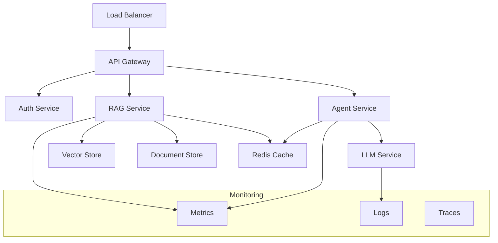

# Production Deployment

Guidelines and best practices for deploying RAGents in production environments.

## Production Readiness Checklist

### Infrastructure Requirements

- [ ] **High Availability** - Multi-zone deployment with failover
- [ ] **Scalability** - Auto-scaling based on load
- [ ] **Security** - API keys, network policies, encryption
- [ ] **Monitoring** - Comprehensive metrics and alerting
- [ ] **Backup & Recovery** - Data backup and disaster recovery plans
- [ ] **Performance Optimization** - Caching, CDN, database tuning

### Application Configuration

- [ ] **Environment Separation** - Dev, staging, production environments
- [ ] **Configuration Management** - Secure configuration handling
- [ ] **Resource Limits** - Appropriate CPU and memory allocation
- [ ] **Health Checks** - Liveness and readiness probes
- [ ] **Graceful Shutdown** - Proper application shutdown handling

## Architecture Patterns

### Microservices Architecture



### Deployment Architecture

```python
# Production deployment configuration
from ragents.config import ProductionConfig

production_config = ProductionConfig(
    # High availability
    replicas=5,
    multi_zone=True,
    load_balancer="nginx",

    # Performance
    enable_caching=True,
    cache_backend="redis",
    cache_ttl=3600,

    # Security
    enable_tls=True,
    api_rate_limiting=True,
    request_timeout=30,

    # Monitoring
    enable_metrics=True,
    enable_tracing=True,
    log_level="info",

    # Resources
    cpu_limit="2000m",
    memory_limit="4Gi",
    storage_size="100Gi"
)
```

## Environment Configuration

### Production Environment Variables

```bash
# Core Configuration
export RAGENTS_ENV="production"
export RAGENTS_DEBUG="false"
export RAGENTS_LOG_LEVEL="info"

# API Configuration
export RAGENTS_API_HOST="0.0.0.0"
export RAGENTS_API_PORT="8000"
export RAGENTS_API_WORKERS="4"
export RAGENTS_MAX_CONNECTIONS="1000"

# LLM Configuration
export RAGENTS_LLM_PROVIDER="openai"
export RAGENTS_LLM_MODEL="gpt-4"
export RAGENTS_LLM_TEMPERATURE="0.1"
export RAGENTS_LLM_MAX_TOKENS="2048"
export RAGENTS_LLM_TIMEOUT="60"

# Vector Store Configuration
export RAGENTS_VECTOR_STORE_TYPE="weaviate"
export RAGENTS_VECTOR_STORE_URL="https://weaviate.production.com"
export RAGENTS_VECTOR_STORE_TIMEOUT="30"

# Caching Configuration
export RAGENTS_ENABLE_CACHING="true"
export RAGENTS_CACHE_BACKEND="redis"
export RAGENTS_REDIS_URL="redis://redis.production.com:6379"
export RAGENTS_CACHE_TTL="3600"

# Monitoring Configuration
export RAGENTS_ENABLE_METRICS="true"
export RAGENTS_METRICS_PORT="9090"
export RAGENTS_ENABLE_TRACING="true"
export RAGENTS_JAEGER_ENDPOINT="http://jaeger.monitoring.com:14268"

# Security Configuration
export RAGENTS_ENABLE_AUTH="true"
export RAGENTS_JWT_SECRET="your-jwt-secret"
export RAGENTS_API_RATE_LIMIT="100"
export RAGENTS_CORS_ORIGINS="https://yourdomain.com"
```

### Secrets Management

```bash
# Using AWS Secrets Manager
aws secretsmanager create-secret \
    --name "ragents/production/api-keys" \
    --description "API keys for RAGents production" \
    --secret-string '{
        "openai_api_key": "sk-...",
        "anthropic_api_key": "sk-ant-...",
        "weaviate_api_key": "...",
        "redis_password": "..."
    }'

# Using Kubernetes Secrets
kubectl create secret generic ragents-secrets \
    --from-literal=openai-api-key="sk-..." \
    --from-literal=anthropic-api-key="sk-ant-..." \
    --from-literal=weaviate-api-key="..." \
    --from-literal=redis-password="..." \
    --namespace=production

# Using HashiCorp Vault
vault kv put secret/ragents/production \
    openai_api_key="sk-..." \
    anthropic_api_key="sk-ant-..." \
    weaviate_api_key="..." \
    redis_password="..."
```

## High Availability Setup

### Load Balancer Configuration

```nginx
# nginx.conf for RAGents
upstream ragents_backend {
    least_conn;
    server ragents-1.production.com:8000 max_fails=3 fail_timeout=30s;
    server ragents-2.production.com:8000 max_fails=3 fail_timeout=30s;
    server ragents-3.production.com:8000 max_fails=3 fail_timeout=30s;
}

server {
    listen 443 ssl http2;
    server_name api.ragents.com;

    ssl_certificate /etc/ssl/certs/ragents.crt;
    ssl_certificate_key /etc/ssl/private/ragents.key;

    # Security headers
    add_header X-Frame-Options DENY;
    add_header X-Content-Type-Options nosniff;
    add_header X-XSS-Protection "1; mode=block";

    # Rate limiting
    limit_req_zone $binary_remote_addr zone=api:10m rate=10r/s;
    limit_req zone=api burst=20 nodelay;

    location / {
        proxy_pass http://ragents_backend;
        proxy_set_header Host $host;
        proxy_set_header X-Real-IP $remote_addr;
        proxy_set_header X-Forwarded-For $proxy_add_x_forwarded_for;
        proxy_set_header X-Forwarded-Proto $scheme;

        # Timeouts
        proxy_connect_timeout 5s;
        proxy_send_timeout 60s;
        proxy_read_timeout 60s;

        # Health checks
        proxy_next_upstream error timeout invalid_header http_500 http_502 http_503;
    }

    location /health {
        access_log off;
        proxy_pass http://ragents_backend;
        proxy_connect_timeout 1s;
        proxy_send_timeout 1s;
        proxy_read_timeout 1s;
    }
}
```

### Database High Availability

```python
# Vector store cluster configuration
from ragents.vector_stores import WeaviateClusterConfig

weaviate_cluster = WeaviateClusterConfig(
    nodes=[
        "https://weaviate-1.production.com",
        "https://weaviate-2.production.com",
        "https://weaviate-3.production.com"
    ],
    replication_factor=3,
    consistency_level="quorum",
    load_balancing="round_robin",
    health_check_interval=30,
    retry_attempts=3,
    circuit_breaker=True
)

# Redis cluster for caching
redis_cluster_config = {
    "hosts": [
        "redis-1.production.com:6379",
        "redis-2.production.com:6379",
        "redis-3.production.com:6379"
    ],
    "password": "${REDIS_PASSWORD}",
    "ssl": True,
    "health_check_interval": 10,
    "max_connections": 100,
    "retry_on_timeout": True
}
```

## Performance Optimization

### Caching Strategy

```python
# Multi-level caching configuration
from ragents.caching import MultiLevelCache

cache_config = MultiLevelCache(
    levels=[
        {
            "name": "memory",
            "backend": "in_memory",
            "size": "1GB",
            "ttl": 300  # 5 minutes
        },
        {
            "name": "redis",
            "backend": "redis",
            "url": "redis://redis.production.com:6379",
            "ttl": 3600  # 1 hour
        },
        {
            "name": "disk",
            "backend": "disk",
            "path": "/var/cache/ragents",
            "size": "10GB",
            "ttl": 86400  # 1 day
        }
    ],
    cache_strategies={
        "embeddings": ["memory", "redis", "disk"],
        "responses": ["memory", "redis"],
        "documents": ["redis", "disk"]
    }
)
```

### Auto-Scaling Configuration

```yaml
# Horizontal Pod Autoscaler for production
apiVersion: autoscaling/v2
kind: HorizontalPodAutoscaler
metadata:
  name: ragents-hpa-production
spec:
  scaleTargetRef:
    apiVersion: apps/v1
    kind: Deployment
    name: ragents-production
  minReplicas: 5
  maxReplicas: 50
  metrics:
  - type: Resource
    resource:
      name: cpu
      target:
        type: Utilization
        averageUtilization: 60
  - type: Resource
    resource:
      name: memory
      target:
        type: Utilization
        averageUtilization: 70
  - type: Pods
    pods:
      metric:
        name: requests_per_second
      target:
        type: AverageValue
        averageValue: "10"
  behavior:
    scaleDown:
      stabilizationWindowSeconds: 300
      policies:
      - type: Percent
        value: 20
        periodSeconds: 120
    scaleUp:
      stabilizationWindowSeconds: 30
      policies:
      - type: Percent
        value: 100
        periodSeconds: 30
```

## Monitoring and Alerting

### Comprehensive Monitoring Stack

```python
# Production monitoring configuration
from ragents.observability import ProductionMonitoring

monitoring = ProductionMonitoring(
    metrics={
        "prometheus": {
            "endpoint": "http://prometheus.monitoring.com:9090",
            "scrape_interval": "15s",
            "retention": "15d"
        }
    },
    tracing={
        "jaeger": {
            "endpoint": "http://jaeger.monitoring.com:14268",
            "sampling_rate": 0.1  # 10% sampling in production
        }
    },
    logging={
        "elasticsearch": {
            "hosts": ["elasticsearch.logging.com:9200"],
            "index_pattern": "ragents-logs-*",
            "retention_days": 30
        }
    },
    alerting={
        "slack_webhook": "https://hooks.slack.com/...",
        "pagerduty_key": "...",
        "email_smtp": "smtp.gmail.com:587"
    }
)
```

### Critical Alerts Configuration

```yaml
# AlertManager rules for RAGents
groups:
- name: ragents.production
  rules:
  - alert: RAGentsHighLatency
    expr: histogram_quantile(0.95, ragents_request_duration_seconds) > 5
    for: 2m
    labels:
      severity: warning
    annotations:
      summary: "RAGents high latency detected"
      description: "95th percentile latency is {{ $value }}s"

  - alert: RAGentsHighErrorRate
    expr: rate(ragents_requests_total{status=~"5.."}[5m]) > 0.1
    for: 1m
    labels:
      severity: critical
    annotations:
      summary: "RAGents high error rate"
      description: "Error rate is {{ $value | humanizePercentage }}"

  - alert: RAGentsMemoryUsage
    expr: ragents_memory_usage_bytes / ragents_memory_limit_bytes > 0.9
    for: 5m
    labels:
      severity: warning
    annotations:
      summary: "RAGents high memory usage"
      description: "Memory usage is {{ $value | humanizePercentage }}"

  - alert: VectorStoreDown
    expr: up{job="weaviate"} == 0
    for: 30s
    labels:
      severity: critical
    annotations:
      summary: "Vector store is down"
      description: "Weaviate instance {{ $labels.instance }} is down"
```

## Security Hardening

### API Security

```python
# Production security configuration
from ragents.security import ProductionSecurity

security_config = ProductionSecurity(
    authentication={
        "enabled": True,
        "method": "jwt",
        "jwt_secret": "${JWT_SECRET}",
        "jwt_expiry": 3600,
        "refresh_token_enabled": True
    },
    authorization={
        "enabled": True,
        "rbac": True,
        "default_role": "user",
        "admin_users": ["admin@company.com"]
    },
    rate_limiting={
        "enabled": True,
        "requests_per_minute": 100,
        "burst_limit": 20,
        "whitelist_ips": ["10.0.0.0/8"]
    },
    input_validation={
        "max_query_length": 10000,
        "allowed_file_types": [".pdf", ".txt", ".docx"],
        "max_file_size": "10MB",
        "sanitize_html": True
    },
    encryption={
        "data_at_rest": True,
        "data_in_transit": True,
        "key_rotation_days": 90
    }
)
```

### Network Security

```bash
# Firewall rules for production
# Allow only necessary ports
ufw allow 22/tcp    # SSH
ufw allow 80/tcp    # HTTP (redirect to HTTPS)
ufw allow 443/tcp   # HTTPS
ufw allow 9090/tcp  # Metrics (from monitoring network only)

# Block all other traffic
ufw default deny incoming
ufw default allow outgoing

# Enable firewall
ufw enable

# Configure fail2ban for brute force protection
cat > /etc/fail2ban/jail.local << EOF
[sshd]
enabled = true
port = ssh
filter = sshd
logpath = /var/log/auth.log
maxretry = 3
bantime = 3600

[ragents-api]
enabled = true
port = 443
filter = ragents-api
logpath = /var/log/nginx/access.log
maxretry = 10
bantime = 600
EOF
```

## Backup and Recovery

### Automated Backup Strategy

```python
# Backup configuration
from ragents.backup import BackupManager

backup_manager = BackupManager(
    schedule={
        "vector_store": {
            "frequency": "daily",
            "time": "02:00",
            "retention_days": 30
        },
        "documents": {
            "frequency": "hourly",
            "retention_hours": 168  # 1 week
        },
        "configuration": {
            "frequency": "weekly",
            "retention_weeks": 12
        }
    },
    storage={
        "type": "s3",
        "bucket": "ragents-backups-production",
        "encryption": True,
        "versioning": True
    },
    monitoring={
        "alerts_on_failure": True,
        "success_notifications": False,
        "backup_verification": True
    }
)
```

### Disaster Recovery Plan

```bash
#!/bin/bash
# Disaster recovery script

set -e

echo "Starting RAGents disaster recovery..."

# 1. Restore vector store from backup
echo "Restoring vector store..."
kubectl apply -f disaster-recovery/weaviate-restore.yaml

# 2. Restore application configuration
echo "Restoring configuration..."
kubectl apply -f disaster-recovery/config-restore.yaml

# 3. Deploy application with recovery settings
echo "Deploying application..."
helm upgrade ragents ./helm-chart \
    --namespace production \
    --values disaster-recovery/values.yaml \
    --set recovery.enabled=true

# 4. Verify health
echo "Verifying health..."
kubectl wait --for=condition=ready pod -l app=ragents -n production --timeout=300s

# 5. Run health checks
echo "Running health checks..."
curl -f http://ragents.production.com/health || exit 1

echo "Disaster recovery completed successfully!"
```

## Performance Testing

### Load Testing Configuration

```python
# Load testing with Locust
from locust import HttpUser, task, between

class RAGentsUser(HttpUser):
    wait_time = between(1, 3)

    def on_start(self):
        # Authenticate user
        response = self.client.post("/auth/login", json={
            "username": "test@example.com",
            "password": "testpass"
        })
        self.token = response.json()["token"]
        self.client.headers.update({"Authorization": f"Bearer {self.token}"})

    @task(3)
    def query_simple(self):
        self.client.post("/api/query", json={
            "query": "What is machine learning?",
            "top_k": 5
        })

    @task(2)
    def query_complex(self):
        self.client.post("/api/query", json={
            "query": "Explain the differences between supervised and unsupervised learning algorithms",
            "top_k": 10,
            "use_reranking": True
        })

    @task(1)
    def upload_document(self):
        with open("test_document.pdf", "rb") as f:
            self.client.post("/api/documents", files={"file": f})
```

### Performance Benchmarks

```bash
# Run load tests
locust -f load_test.py --host=https://ragents.production.com --users=100 --spawn-rate=10

# Database performance testing
kubectl run weaviate-benchmark --rm -i --tty \
    --image=semitechnologies/weaviate-benchmark \
    -- --host=weaviate.production.com --queries=1000 --concurrent=10

# Network latency testing
for region in us-east-1 eu-west-1 ap-southeast-1; do
    aws ec2 run-instances \
        --region $region \
        --image-id ami-12345 \
        --instance-type t3.micro \
        --user-data file://latency-test.sh
done
```

## Deployment Automation

### CI/CD Pipeline

```yaml
# .github/workflows/production-deploy.yml
name: Production Deployment

on:
  push:
    tags:
      - 'v*'

jobs:
  deploy:
    runs-on: ubuntu-latest
    environment: production

    steps:
    - uses: actions/checkout@v3

    - name: Configure AWS credentials
      uses: aws-actions/configure-aws-credentials@v2
      with:
        aws-access-key-id: ${{ secrets.AWS_ACCESS_KEY_ID }}
        aws-secret-access-key: ${{ secrets.AWS_SECRET_ACCESS_KEY }}
        aws-region: us-east-1

    - name: Build and push Docker image
      run: |
        docker build -t ragents:${{ github.ref_name }} .
        docker tag ragents:${{ github.ref_name }} 123456789.dkr.ecr.us-east-1.amazonaws.com/ragents:${{ github.ref_name }}
        docker push 123456789.dkr.ecr.us-east-1.amazonaws.com/ragents:${{ github.ref_name }}

    - name: Deploy to Kubernetes
      run: |
        aws eks update-kubeconfig --name production-cluster
        helm upgrade ragents ./helm-chart \
          --namespace production \
          --set image.tag=${{ github.ref_name }} \
          --set config.version=${{ github.ref_name }} \
          --wait --timeout=600s

    - name: Run smoke tests
      run: |
        kubectl wait --for=condition=ready pod -l app=ragents -n production --timeout=300s
        curl -f https://ragents.production.com/health
        python smoke_tests.py

    - name: Notify deployment
      uses: 8398a7/action-slack@v3
      with:
        status: ${{ job.status }}
        text: "RAGents ${{ github.ref_name }} deployed to production"
      env:
        SLACK_WEBHOOK_URL: ${{ secrets.SLACK_WEBHOOK }}
```

## Cost Optimization

### Resource Optimization

```python
# Cost-aware configuration
from ragents.optimization import CostOptimizer

cost_optimizer = CostOptimizer(
    strategies=[
        "right_sizing",      # Optimize instance sizes
        "spot_instances",    # Use spot instances where possible
        "scheduled_scaling", # Scale down during off-hours
        "cache_optimization", # Optimize caching to reduce API calls
        "model_selection"    # Choose cost-effective models
    ],
    budgets={
        "daily_llm_costs": 100,    # $100/day for LLM API calls
        "infrastructure": 500,      # $500/day for infrastructure
        "storage": 50              # $50/day for storage
    },
    alerts={
        "cost_threshold": 0.8,     # Alert at 80% of budget
        "anomaly_detection": True   # Detect unusual cost spikes
    }
)
```

### Usage Analytics

```python
# Track usage and costs
from ragents.analytics import UsageAnalytics

analytics = UsageAnalytics(
    metrics=[
        "api_calls_per_hour",
        "tokens_consumed",
        "storage_usage",
        "compute_costs",
        "user_activity"
    ],
    reporting={
        "daily_summary": True,
        "weekly_trends": True,
        "cost_breakdown": True,
        "optimization_suggestions": True
    },
    integrations={
        "aws_cost_explorer": True,
        "datadog": True,
        "grafana": True
    }
)
```

## Next Steps

- **[Kubernetes Deployment](kubernetes.md)** - Detailed Kubernetes setup
- **[Docker Configuration](docker.md)** - Container optimization
- **[Monitoring Setup](../advanced/observability.md)** - Comprehensive monitoring
- **[Security Guide](../advanced/security.md)** - Security best practices