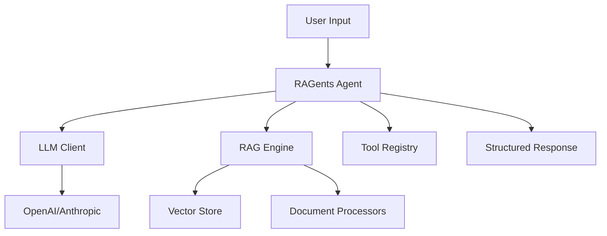

# RAGents Documentation

Welcome to **RAGents** - an advanced agentic RAG framework with multimodal processing and type-safe LLM interactions.

## What is RAGents?

RAGents is a comprehensive framework for building intelligent agents that combine:

- **Retrieval-Augmented Generation (RAG)** with multimodal processing capabilities
- **Type-safe LLM interactions** using the instructor package
- **Extensible agent architectures** including Decision Trees, ReAct, and Graph Planners
- **Production-ready deployment** with Docker, Kubernetes, and Kubeflow support

## Key Features

### 🤖 Multiple Agent Types
- **Decision Tree Agents**: Structured reasoning with branching logic
- **ReAct Agents**: Reasoning and Acting with tool integration
- **Graph Planner Agents**: Complex multi-step planning and execution

### 📚 Advanced RAG Engine
- **Multimodal Processing**: Handle text, images, PDFs, and more
- **Pluggable Vector Stores**: ChromaDB, Weaviate, pgvector, Elasticsearch
- **Smart Reranking**: Multiple reranking strategies for better relevance
- **Query Rewriting**: DSPy-inspired query optimization

### 🧠 Type-Safe LLM Integration
- **Structured Outputs**: Pydantic models for reliable responses
- **Multiple Providers**: OpenAI, Anthropic with unified interface
- **Async Support**: Built for high-performance applications

### 🔬 Evaluation & Observability
- **Built-in Metrics**: RAGAS-style evaluation framework
- **OpenInference Tracing**: Comprehensive observability
- **Structured Logging**: Debug and monitor your agents

### 🚀 Production Ready
- **Docker Containerization**: Easy deployment and scaling
- **Kubernetes Integration**: Cloud-native orchestration
- **Kubeflow Pipelines**: ML workflow management
- **CI/CD Ready**: GitHub Actions for automated testing and deployment

## Quick Start

```bash
# Install RAGents
pip install ragents

# Set your API key
export OPENAI_API_KEY="your-api-key-here"

# Run the demo
python -m ragents.demo
```

## Architecture Overview



## Getting Started

Ready to build intelligent agents? Check out our [installation guide](getting-started/installation.md) and [quick start tutorial](getting-started/quickstart.md).

## Community & Support

- **GitHub**: [ragents repository](https://github.com/yourusername/ragents)
- **Issues**: Report bugs and request features
- **Discussions**: Ask questions and share ideas

---

*RAGents - Building the future of intelligent agents, one conversation at a time.*