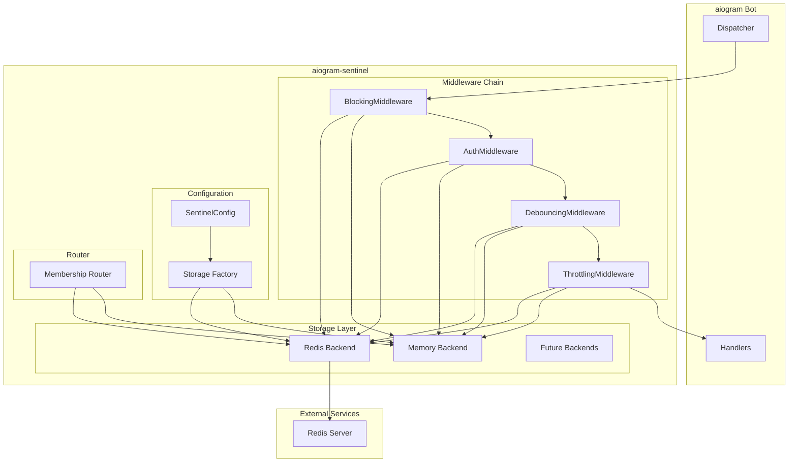
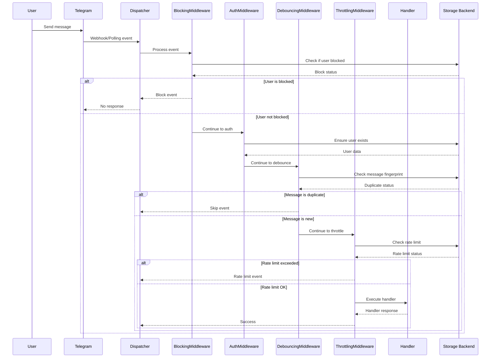
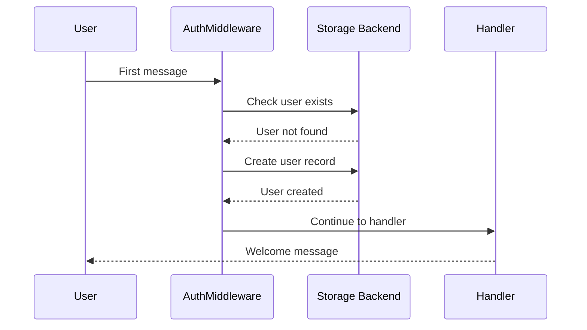
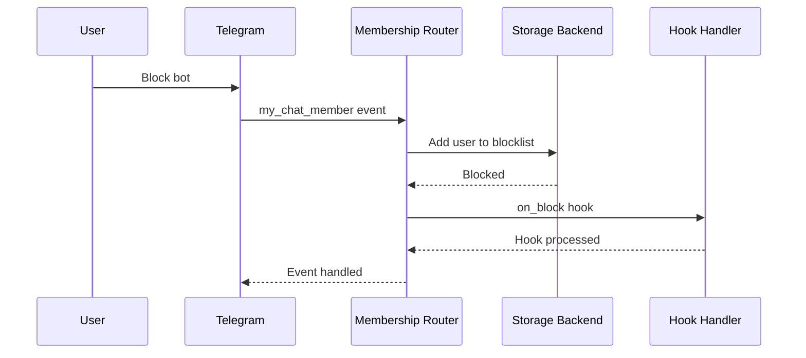

# Architecture

This document explains the system design and architecture of aiogram-sentinel.

## Goals & Non-Goals

### Goals

**Primary Goals:**
- **Drop-in Protection**: Easy integration with existing aiogram v3 bots
- **Production Ready**: Scalable, reliable, and performant for real-world usage
- **Developer Experience**: Clear APIs, good defaults, comprehensive documentation
- **Flexibility**: Configurable protection levels and extensible architecture
- **Type Safety**: Full type annotations and runtime validation

**Secondary Goals:**
- **Zero Dependencies**: Core functionality works without external services
- **Battery Included**: Sensible defaults that work out of the box
- **Observability**: Hooks and metrics for monitoring and debugging
- **Security**: Protection against common attack vectors and data leaks

### Non-Goals

**Explicitly Out of Scope:**
- **AI/ML Spam Detection**: No machine learning or content analysis
- **Database Integration**: No direct database connections (use Redis or custom backends)
- **Bot Framework**: Not a replacement for aiogram, just protection middleware
- **GUI/Admin Interface**: No web interfaces or management dashboards
- **Multi-Platform**: Telegram-only, no support for other messaging platforms
- **Real-time Analytics**: No built-in analytics or reporting features

## High-Level Architecture



## Overview

aiogram-sentinel is designed as a modular edge hygiene library for aiogram v3 bots. It provides protection against spam, abuse, and unwanted behavior through a combination of middleware, storage backends, and event hooks.

## Core Components

### 1. Storage Backends

Storage backends provide the data persistence layer for all aiogram-sentinel operations.

#### Backend Protocols

All backends implement standardized protocols defined in `storage/base.py`:

- **RateLimiterBackend**: Rate limiting with sliding windows
- **DebounceBackend**: Message deduplication and timing
- **BlocklistBackend**: User blocking and unblocking
- **UserRepo**: User registration and data management

#### Memory Backend

The memory backend (`storage/memory.py`) provides:

- **Fast access**: In-memory data structures for development
- **Thread safety**: `asyncio.Lock` for concurrent access
- **Sliding windows**: `collections.deque` for rate limiting
- **No persistence**: Data lost on restart

#### Redis Backend

The Redis backend (`storage/redis.py`) provides:

- **Persistence**: Data survives restarts
- **Scalability**: Multiple bot instances can share data
- **Namespacing**: Key prefixes prevent conflicts
- **Atomic operations**: Redis commands ensure consistency

### 2. Middlewares

Middlewares are the core protection mechanisms that process events before they reach handlers.

#### Middleware Order

The middleware chain follows a strict order for optimal performance:

```
Blocking → Auth → Debouncing → Throttling → Handlers
```

#### BlockingMiddleware

- **Purpose**: Early user blocking based on blocklist
- **Performance**: Single backend call, early return
- **Data**: Sets `data["sentinel_blocked"] = True` when blocked
- **Scope**: All event types

#### AuthMiddleware

- **Purpose**: User authentication and context management
- **Features**: Auto-registration, custom validation hooks
- **Data**: Sets `data["user_context"]` and `data["user_exists"]`
- **Integration**: Works with `@require_registered` decorator

#### DebounceMiddleware

- **Purpose**: Prevent duplicate message processing
- **Method**: SHA256 fingerprinting of message content
- **Data**: Sets `data["sentinel_debounced"] = True` when duplicate
- **Scope**: Message and callback events

#### ThrottlingMiddleware

- **Purpose**: Rate limiting with configurable windows
- **Features**: Per-handler limits, retry notifications
- **Data**: Sets `data["sentinel_rate_limited"] = True` when limited
- **Hooks**: Optional `on_rate_limited` callback

### 3. Router

The membership router (`routers/my_chat_member.py`) handles bot membership changes:

- **Auto-sync**: Updates blocklist based on membership status
- **Private chats only**: Ignores group chat events
- **State transitions**: `kicked/left` → blocked, `member` → unblocked
- **Hooks**: `on_block` and `on_unblock` callbacks

### 4. Setup Helper

The setup helper (`sentinel.py`) provides a simplified one-call configuration:

```python
# Basic setup
router, backends = await Sentinel.setup(dp, config)

# Advanced setup with hooks
Sentinel.add_hooks(router, backends, config, **hooks)
```

**Features**:
- Automatic middleware registration
- Backend instantiation
- Router inclusion
- Separated hook configuration for advanced users

## Data Flow

### Event Processing

```
1. Event arrives → Dispatcher
2. BlockingMiddleware → Check blocklist
3. AuthMiddleware → Ensure user, validate
4. DebounceMiddleware → Check duplicates
5. ThrottlingMiddleware → Check rate limits
6. Handler execution
```

## Lifecycle & Sequence Diagrams

### Message Processing Flow



### User Registration Flow



### Blocklist Synchronization Flow



### Key Generation

Keys are generated consistently across all backends:

```python
# Rate limiting
rate_key(user_id, handler_name, **scope)

# Debouncing  
debounce_key(user_id, handler_name, fingerprint=content_hash)

# User management
user_key(user_id)
```

### State Management

#### Rate Limiting State

```
Memory: {key: deque([timestamp1, timestamp2, ...])}
Redis:  {key: counter_value} with TTL
```

#### Debouncing State

```
Memory: {key: last_seen_timestamp}
Redis:  {key: "1"} with TTL (SET NX EX)
```

#### Blocklist State

```
Memory: {user_id1, user_id2, ...}
Redis:  SADD/SREM/SISMEMBER operations
```

#### User State

```
Memory: {user_id: {user_data}}
Redis:  HSET/HSETNX/HGETALL operations
```

## Configuration

### SentinelConfig

Centralized configuration for all components:

```python
@dataclass
class SentinelConfig:
    backend: str = "memory"  # "memory" or "redis"
    redis_url: str = "redis://localhost:6379"
    redis_prefix: str = "sentinel"
    throttling_default_max: int = 5
    throttling_default_per_seconds: int = 10
    debounce_default_window: int = 2
    # ... validation and defaults
```

### Backend Factory

The factory pattern (`storage/factory.py`) creates backends based on configuration:

```python
def build_backends(config: SentinelConfig) -> BackendsBundle:
    if config.backend == "memory":
        return _build_memory_backends()
    elif config.backend == "redis":
        return _build_redis_backends(config)
```

## Error Handling

### Exception Hierarchy

```
SentinelError (base)
├── ConfigurationError
├── BackendOperationError
└── MiddlewareError
```

### Error Recovery

- **Backend failures**: Graceful degradation, log errors
- **Hook failures**: Don't break middleware chain
- **Configuration errors**: Fail fast with clear messages

## Performance Considerations

### Memory Backend

- **O(1) operations**: Hash lookups, set operations
- **Memory usage**: Grows with active users
- **Cleanup**: Automatic via sliding windows

### Redis Backend

- **Network latency**: Single Redis call per operation
- **Connection pooling**: Reuse connections
- **Key expiration**: Automatic cleanup via TTL

### Middleware Overhead

- **Blocking**: ~0.1ms (single lookup)
- **Auth**: ~0.5ms (user registration check)
- **Debouncing**: ~0.2ms (fingerprint + lookup)
- **Throttling**: ~0.3ms (counter increment)

## Scalability

### Horizontal Scaling

- **Redis backend**: Multiple bot instances share state
- **Stateless middlewares**: No shared state between instances
- **Key namespacing**: Prevent conflicts between bots

### Vertical Scaling

- **Memory backend**: Limited by RAM
- **Redis backend**: Limited by Redis capacity
- **Middleware chain**: Linear with number of middlewares

## Security

### Data Protection

- **User data**: Minimal storage, no sensitive information
- **Key namespacing**: Prevent data leakage between bots
- **Input validation**: All user inputs validated

### Attack Mitigation

- **Rate limiting**: Prevent spam and DoS
- **Blocking**: Remove problematic users
- **Debouncing**: Prevent duplicate processing
- **Authentication**: Ensure user legitimacy

## Extensibility

### Adding New Backends

1. Implement backend protocols
2. Add to factory function
3. Update configuration options
4. Add tests and documentation

### Adding New Middlewares

1. Inherit from `BaseMiddleware`
2. Follow middleware order guidelines
3. Set appropriate data flags
4. Add to setup helper

### Custom Hooks

All hooks are optional and can be customized:

- **Rate limit hooks**: Custom notifications
- **User resolution**: Custom validation logic
- **Membership hooks**: Custom event handling

## Testing Strategy

### Unit Tests

- **Backend tests**: Isolated backend functionality
- **Middleware tests**: Individual middleware behavior
- **Integration tests**: End-to-end workflows

### Performance Tests

- **Load testing**: High-frequency event processing
- **Memory usage**: Backend memory consumption
- **Latency testing**: Middleware overhead measurement

## Deployment Considerations

### Development

- **Memory backend**: Simple setup, no dependencies
- **Local testing**: All features available
- **Debug logging**: Detailed operation logs

### Production

- **Redis backend**: Persistent, scalable storage
- **Monitoring**: Hook integration for metrics
- **Error handling**: Graceful degradation
- **Configuration**: Environment-based settings
