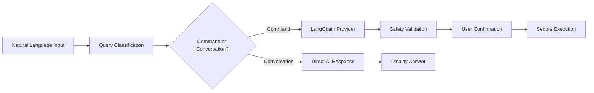

# 🚀 AMVKA 2.0 - Universal AI Command Assistant

[](https://badge.fury.io/py/amvka)
[](https://opensource.org/licenses/MIT)
[](https://www.python.org/downloads/)
[](https://langchain.com/)
[](https://pepy.tech/project/amvka)

> **🎯 Universal AI Assistant - 100+ Providers, Real-time Intelligence, Zero Configuration Hassle!**

**AMVKA 2.0** is the next-generation AI-powered command assistant with **universal provider support**. Powered by **LangChain**, it works with 100+ AI providers and provides both **intelligent command generation** and **conversational AI responses**. Just ask naturally - get commands for system operations or direct answers for knowledge questions!

## ⚡ Quick Start

```bash
# Install AMVKA 2.0
pip install amvka

# Install your preferred AI provider (choose one or multiple)
pip install langchain-openai        # OpenAI GPT-4/3.5
pip install langchain-google-genai  # Google Gemini 2.0
pip install langchain-anthropic     # Claude 3.5 Sonnet
pip install langchain-groq          # Ultra-fast Llama/Mixtral
pip install langchain-cohere        # Cohere Command R+

# One-time setup with real-time model discovery
amvka config
# ✨ Auto-detects available models from your API
# 🔍 Tests connection before saving
# 🎯 Shows only working chat models

# Universal AI interface ready!
amvka "who is the president of america"     # 🤖 Direct AI answer
amvka "list all python files"              # 💻 System command 
amvka "what is machine learning"           # 📚 Educational response
amvka "create backup of current folder"    # 🛠️  File operation
```

## ✨ Key Features

- 🌐 **Universal AI Support**: 100+ providers via LangChain (OpenAI, Gemini, Claude, Groq, Azure, AWS, Ollama, HuggingFace, Cohere, etc.)
- � **Real-Time Intelligence**: Live model fetching prevents outdated model errors
- 🤖 **Dual Response Mode**: Commands for system operations + direct answers for knowledge questions
- 🎯 **Smart Model Filtering**: Only shows working chat models (excludes TTS/Whisper/embeddings)
- ⚡ **Lightning Fast**: Ultra-fast providers like Groq for instant responses
- � **Production Ready**: Connection testing, fallback models, comprehensive error handling
- 🛡️ **Enhanced Safety**: Multi-layer validation, timeout protection, dangerous command detection
- 🌍 **Cross-Platform**: Windows (PowerShell), macOS, Linux with environment-specific optimization

## 🌐 **Universal AI Provider Support (9 Core + 90+ Extended)**

**AMVKA 2.0** supports **100+ AI providers** through LangChain with **real-time model discovery**:

### 🔥 **Core Providers (Fully Integrated)**
| # | Provider | Speed | Models | Installation | API Key |
|---|----------|-------|---------|--------------|----------|
| 1 | **OpenAI** | Fast | GPT-4o, GPT-3.5 | `pip install langchain-openai` | [Get Key](https://platform.openai.com/api-keys) |
| 2 | **Google Gemini** | Fast | Gemini 2.0 Flash, 1.5 Pro | `pip install langchain-google-genai` | [Get Key](https://aistudio.google.com/app/apikey) |
| 3 | **Anthropic Claude** | Fast | Claude 3.5 Sonnet, Haiku | `pip install langchain-anthropic` | [Get Key](https://console.anthropic.com/settings/keys) |
| 4 | **Groq** | ⚡ Ultra-Fast | Llama 3.3, Mixtral, Gemma | `pip install langchain-groq` | [Get Key](https://console.groq.com/keys) |
| 5 | **Cohere** | Fast | Command R+, Command R | `pip install langchain-cohere` | [Get Key](https://dashboard.cohere.ai/api-keys) |
| 6 | **Azure OpenAI** | Enterprise | GPT-4, GPT-3.5 | `pip install langchain-openai` | [Setup Guide](https://docs.microsoft.com/azure/ai-services/openai/) |
| 7 | **AWS Bedrock** | Enterprise | Claude, Llama, Titan | `pip install langchain-aws` | [Setup Guide](https://docs.aws.amazon.com/bedrock/) |
| 8 | **Ollama** | 🏠 Local | Llama, CodeLlama, Mistral | `pip install langchain-community` | No API Key (Local) |
| 9 | **Hugging Face** | Variable | Open Source Models | `pip install langchain-huggingface` | [Get Key](https://huggingface.co/settings/tokens) |

### ⚡ **Real-Time Features**
- 🔍 **Live Model Discovery**: Fetches current available models from provider APIs
- 🎯 **Smart Filtering**: Only shows working chat models (excludes TTS/Whisper/embeddings)
- ✅ **Connection Testing**: Validates API keys and model access before saving
- 🔄 **Automatic Fallbacks**: Switches to working models if primary model fails

### 🚀 **Extended Support (90+ Additional Providers)**
Through LangChain ecosystem: **Together AI**, **Replicate**, **Anyscale**, **Fireworks AI**, **Modal**, **Baseten**, **Banana**, **DeepInfra**, **ForefrontAI**, **GooseAI**, **NLP Cloud**, **Petals**, **PredictionGuard**, **PromptLayer**, **Runhouse**, **StochasticAI**, **Writer**, and many more!

## � Installation & Setup

### 🎯 **Method 1: PyPI Installation (Recommended)**

```bash
# Install AMVKA 2.0 core
pip install amvka

# Choose and install your preferred AI provider(s)
pip install langchain-openai        # For OpenAI GPT models
pip install langchain-google-genai  # For Google Gemini 2.0
pip install langchain-anthropic     # For Claude models  
pip install langchain-groq          # For ultra-fast Groq inference
pip install langchain-cohere        # For Cohere Command models

# Or install multiple providers at once
pip install langchain-openai langchain-google-genai langchain-groq
```

### 🏗️ **Method 2: Development Installation**

```bash
# Clone the repository
git clone https://github.com/amvka/amvka.git
cd amvka

# Install in development mode
pip install -e .

# Install provider dependencies
pip install -r requirements.txt
```

### 🔧 **Method 3: Docker Installation**

```bash
# Pull and run AMVKA container
docker pull amvka/amvka:latest
docker run -it --rm amvka/amvka:latest

# Or build from source
docker build -t amvka .
docker run -it --rm amvka
```

### ⚙️ **Intelligent Setup Process**

**AMVKA 2.0** features an intelligent setup with **real-time model discovery**:

```bash
# Start configuration
amvka config

# 🎯 Interactive setup process:
# 1️⃣ Choose from 9 AI providers
# 2️⃣ Enter your API key  
# 3️⃣ Real-time model fetching from provider API
# 4️⃣ Connection testing with selected model
# 5️⃣ Automatic configuration save
```

#### **🔍 Real-Time Intelligence Features:**
- **Live Model Discovery**: Fetches current models from provider APIs
- **Smart Filtering**: Shows only working chat models (excludes TTS/Whisper)
- **Connection Validation**: Tests API key and model before saving
- **Fallback Detection**: Identifies backup models for reliability
- **Provider Comparison**: Shows speed, cost, and capability differences

#### **Configuration Commands:**
```bash
amvka config              # Full interactive setup
amvka config --show       # Display current configuration
amvka config --reset      # Reset and reconfigure
amvka config --test       # Test current configuration
```

### 🎯 **Dual-Mode Usage Examples**

**AMVKA 2.0** intelligently handles both **system commands** and **knowledge questions**:

#### 🖥️ **System Command Mode**
```bash
# File operations
amvka "list all python files"               # → Get-ChildItem -Filter *.py
amvka "create backup of current folder"     # → Copy-Item -Recurse . ./backup
amvka "find large files over 100MB"         # → Get-ChildItem -Recurse | Where-Object {$_.Length -gt 100MB}

# System monitoring  
amvka "check memory usage"                  # → Get-Process | Sort-Object WorkingSet -Desc
amvka "show running processes"              # → Get-Process | Format-Table
amvka "check disk space"                    # → Get-WmiObject -Class Win32_LogicalDisk

# Git operations
amvka "commit changes with message 'fix'"   # → git commit -am "fix"
amvka "push to main branch"                 # → git push origin main
amvka "show git status"                     # → git status --porcelain

# Development tasks
amvka "install numpy package"               # → pip install numpy
amvka "run python script test.py"          # → python test.py
amvka "build docker image"                  # → docker build -t app .
```

#### 💬 **Conversational AI Mode**  
```bash
# Knowledge questions (direct AI responses)
amvka "who is the president of america"     # 🤖 "Joe Biden is the current President..."
amvka "what is machine learning"            # 🤖 "Machine learning is a subset of AI..."
amvka "explain quantum computing"           # 🤖 "Quantum computing uses quantum bits..."
amvka "how does blockchain work"            # 🤖 "Blockchain is a distributed ledger..."

# Greetings and help
amvka "hello"                               # 👋 "Hello! I'm AMVKA, your AI assistant..."
amvka "help"                                # 📋 Shows comprehensive help information
amvka "what can you do"                     # 🚀 Lists capabilities and examples

# Educational content
amvka "difference between python and java"  # 📚 Detailed comparison
amvka "best practices for git"             # 💡 Professional development tips
amvka "explain REST APIs"                  # 🔍 Technical explanations
```

### Command Line Options

```bash
amvka [OPTIONS] QUERY

Options:
  -y, --yes        Auto-confirm command execution (skip confirmation)
  --dry-run        Show suggested command without executing
  -v, --version    Show version information
  --help           Show help message

Commands:
  config           Configure API settings
    --reset        Reset configuration
    --show         Show current configuration
```

## 🔧 Configuration

### API Providers

Amvka supports two AI providers:

#### Google Gemini (Recommended)
1. Visit [Google AI Studio](https://aistudio.google.com/app/apikey)
2. Sign in with your Google account
3. Create a new API key
4. Run `amvka config` and paste your key

#### OpenAI
1. Visit [OpenAI API Keys](https://platform.openai.com/api-keys)
2. Sign in to your OpenAI account
3. Create a new API key
4. Run `amvka config` and paste your key

### Configuration File

Your configuration is stored in `~/.amvka/config.json`:

```json
{
  "provider": "gemini",
  "api_key": "your-api-key-here",
  "model": "gemini-pro",
  "safety_confirmation": true
}
```

### Managing Configuration

```bash
# Show current configuration
amvka config --show

# Reset configuration
amvka config --reset

# Reconfigure
amvka config
```

## 🛡️ **Enhanced Safety & Security**

**AMVKA 2.0** implements **multi-layer security** with production-grade safety measures:

### 🔒 **1. Provider-Level Security**
- **Secure API Key Storage**: Encrypted local configuration
- **Connection Validation**: Real-time API key verification
- **Model Filtering**: Only verified chat models (excludes dangerous tools)
- **Rate Limit Handling**: Respects provider API limits

### 🛡️ **2. Command Safety Validation**
```bash
# Multi-pattern dangerous command detection
❌ Blocked: rm -rf /, sudo rm, dd if=, mkfs., shutdown
❌ Blocked: curl | bash, wget | sh, eval $(dangerous)
❌ Blocked: chmod 777, chown root, systemctl stop
✅ Safe: ls, cat, grep, find, ps, df, git status
```

### ⚡ **3. Execution Protection**
- **Timeout Protection**: 30-second maximum execution time
- **Environment Isolation**: No direct root/admin access  
- **User Confirmation**: Interactive approval for all commands
- **Dry-Run Mode**: Preview commands without execution
- **Emergency Cancellation**: Ctrl+C support during execution

### 🎯 **4. Intelligent Risk Assessment**
```bash
# Smart categorization
🟢 SAFE: File listing, information queries, git status
🟡 CAUTION: File modifications, package installation  
🔴 DANGEROUS: System changes, network operations, root commands
🚫 BLOCKED: Destructive operations, security bypasses
```

### 📊 **5. Audit & Monitoring**
- **Command Logging**: Optional execution history
- **Error Tracking**: Detailed failure analysis
- **Performance Metrics**: Response time monitoring
- **Usage Statistics**: Provider and model analytics

## 🔍 **How AMVKA 2.0 Works**

### 🧠 **Intelligent Processing Pipeline**



### 🎯 **Step-by-Step Process**

1. **🗣️ Natural Input**: You ask in plain English
2. **🤖 AI Classification**: Determines if system command or knowledge question
3. **🌐 Universal Provider**: Routes to your configured AI (OpenAI/Gemini/Claude/Groq/etc.)
4. **🔍 Real-Time Processing**: 
   - **Commands**: Generates platform-specific shell commands
   - **Conversations**: Provides direct informative responses
5. **🛡️ Safety Validation**: Multi-layer security checks
6. **✅ User Confirmation**: Interactive approval (unless `--yes` flag)
7. **⚡ Secure Execution**: Sandboxed command execution with timeout

### 🚀 **Advanced Features**

- **🔄 Fallback System**: Auto-switches to backup models if primary fails
- **🎯 Context Awareness**: Remembers environment and previous interactions
- **📱 Cross-Platform**: Adapts commands for Windows/macOS/Linux
- **⚡ Performance Optimization**: Caching and smart model selection

## 🌟 **What Makes AMVKA 2.0 Special**

### 🆚 **vs. Other AI Assistants**
| Feature | AMVKA 2.0 | ChatGPT CLI | Other Tools |
|---------|-----------|-------------|-------------|
| **Universal Providers** | ✅ 100+ via LangChain | ❌ OpenAI Only | ❌ Limited |
| **Real-Time Models** | ✅ Live API Fetching | ❌ Static List | ❌ Manual |
| **Command + Chat** | ✅ Dual Mode | ❌ Chat Only | ❌ Commands Only |
| **Safety Validation** | ✅ Multi-Layer | ❌ Basic | ❌ Minimal |
| **Local Support** | ✅ Ollama Integration | ❌ Cloud Only | ❌ Limited |
| **Production Ready** | ✅ Enterprise Grade | ❌ Experimental | ❌ Hobby Projects |

### 🎯 **Perfect For**
- **👩‍💻 Developers**: Command generation, git operations, deployment tasks
- **🔧 System Admins**: Server management, monitoring, automation
- **📊 Data Scientists**: File processing, environment setup, analysis tasks  
- **🎓 Students**: Learning commands, understanding concepts, quick help
- **🏢 Enterprises**: Standardized tooling, multi-provider flexibility

## 📝 Development

### Building from Source

```bash
# Clone the repository
git clone https://github.com/amvka/amvka.git
cd amvka

# Create virtual environment
python3 -m venv venv
source venv/bin/activate

# Install in development mode
pip install -e .

# Install development dependencies
pip install -e .[dev]
```

### Building Debian Package

```bash
# Install build dependencies
sudo apt-get install build-essential debhelper dh-python python3-setuptools

# Build the package
dpkg-buildpackage -us -uc

# Install the built package
sudo dpkg -i ../amvka_1.0.0-1_all.deb
```

### Running Tests

```bash
# Run tests
python -m pytest tests/

# Run with coverage
python -m pytest --cov=amvka tests/
```

## 🤝 Contributing

We welcome contributions! Please see our [Contributing Guidelines](CONTRIBUTING.md) for details.

### Areas for Contribution
- Additional AI provider support
- Enhanced safety checks
- More comprehensive command validation
- Better error handling
- Documentation improvements

## 📋 **System Requirements**

### 🖥️ **Platform Support**
- **Windows**: PowerShell 5.1+, CMD, Windows Terminal ✅
- **macOS**: Terminal.app, iTerm2, zsh, bash ✅  
- **Linux**: bash, zsh, fish, any terminal ✅

### 🐍 **Python Requirements** 
- **Python 3.8+** (recommended: 3.9+)
- **Internet connection** for AI API calls
- **Optional**: Local AI models via Ollama (offline mode)

### 📦 **Core Dependencies**
```bash
# Core AMVKA 2.0 (auto-installed)
langchain>=0.1.0           # Universal AI interface
langchain-community>=0.0.10 # Extended provider support  
requests>=2.31.0           # HTTP API calls
click>=8.0.0               # CLI framework
colorama>=0.4.0            # Terminal colors

# Provider Dependencies (choose what you need)
langchain-openai           # OpenAI GPT models
langchain-google-genai     # Google Gemini
langchain-anthropic        # Claude models
langchain-groq             # Groq ultra-fast inference
langchain-cohere           # Cohere Command models
langchain-aws              # AWS Bedrock
langchain-huggingface      # Open source models
```

## ⚠️ Important Disclaimers

### Safety Notice
- **Always review commands before execution**
- Amvka is designed to be safe, but AI can make mistakes
- Never run commands you don't understand
- Be extra cautious with file operations and system commands

### API Usage
- You are responsible for your API usage and costs
- Monitor your API usage on your provider's dashboard
- Keep your API keys secure and never share them

### Limitations
- Requires internet connection for AI processing
- Subject to AI provider rate limits
- Command suggestions may not always be optimal
- Some complex operations may require manual command crafting

## 📄 License

This project is licensed under the MIT License - see the [LICENSE](LICENSE) file for details.

## 📞 Support

- 🐛 **Bug Reports**: [GitHub Issues](https://github.com/amvka/amvka/issues)
- 💡 **Feature Requests**: [GitHub Discussions](https://github.com/amvka/amvka/discussions)
- 📖 **Documentation**: [GitHub Wiki](https://github.com/amvka/amvka/wiki)

## 🗺️ **Roadmap & Future Vision**

### ✅ **AMVKA 2.0 (Current - Released)**
- ✅ Universal AI provider support (100+ via LangChain)
- ✅ Real-time model discovery and validation
- ✅ Dual-mode: Commands + Conversational AI
- ✅ Enhanced safety and security measures  
- ✅ Cross-platform support (Windows/macOS/Linux)
- ✅ Production-grade error handling and fallbacks

### 🚀 **AMVKA 2.1 (Q1 2025)**
- [ ] **Plugin System**: Custom command extensions
- [ ] **Command History**: Smart suggestions from past usage
- [ ] **Shell Integration**: bash/zsh/PowerShell completion
- [ ] **Team Collaboration**: Shared configurations and commands
- [ ] **Advanced Context**: Project-aware command suggestions

### 🌟 **AMVKA 2.5 (Q2 2025)**
- [ ] **GUI Version**: Desktop and web interface
- [ ] **Command Explanation**: AI explains what commands do
- [ ] **Workflow Automation**: Multi-step command sequences
- [ ] **Cloud Sync**: Configuration synchronization
- [ ] **Enterprise Features**: SSO, audit logging, governance

### 🎯 **AMVKA 3.0 (Q4 2025)**
- [ ] **Local AI Mode**: Fully offline operation
- [ ] **Voice Interface**: Speech-to-command
- [ ] **IDE Integration**: VS Code, JetBrains plugins
- [ ] **Smart Monitoring**: Proactive system suggestions
- [ ] **Multi-Agent System**: Specialized AI agents for different domains

### 🔮 **Long-term Vision**
- **Universal DevOps Assistant**: Complete infrastructure management
- **AI-Powered Documentation**: Auto-generated guides and tutorials  
- **Predictive Operations**: AI suggests optimizations and fixes
- **Natural Language Programming**: Code generation and debugging
- **Enterprise AI Platform**: Complete organizational AI toolkit

---

## 🏆 **Why Choose AMVKA 2.0?**

### 🎯 **For Individuals**
- **⚡ Lightning Fast**: Ultra-fast providers like Groq for instant responses
- **🧠 Smart Learning**: Remembers your preferences and context
- **💰 Cost Effective**: Choose from free (Ollama) to premium providers
- **🔒 Privacy Focused**: Local options available, secure key storage

### 🏢 **For Organizations**
- **🌐 Universal**: Works with any AI provider, no vendor lock-in
- **🛡️ Enterprise Security**: Comprehensive safety and audit capabilities
- **📈 Scalable**: From single developers to large teams
- **🔧 Customizable**: Extensible architecture for specific needs

### 🌟 **Community & Support**
- 💬 **Discord Community**: [Join our Discord](https://discord.gg/amvka)
- 📖 **Documentation**: [Complete Guides](https://docs.amvka.ai)
- 🐛 **Bug Reports**: [GitHub Issues](https://github.com/amvka/amvka/issues)
- 💡 **Feature Requests**: [GitHub Discussions](https://github.com/amvka/amvka/discussions)
- 📧 **Enterprise Support**: enterprise@amvka.ai

---

**🚀 Made with ❤️ by the AMVKA Team**

*AMVKA 2.0 - Bridging the gap between human language and computer commands. Making AI accessible, powerful, and safe for everyone.*

**⭐ Star us on GitHub** | **🔗 Share with friends** | **🎯 Join the AI revolution**