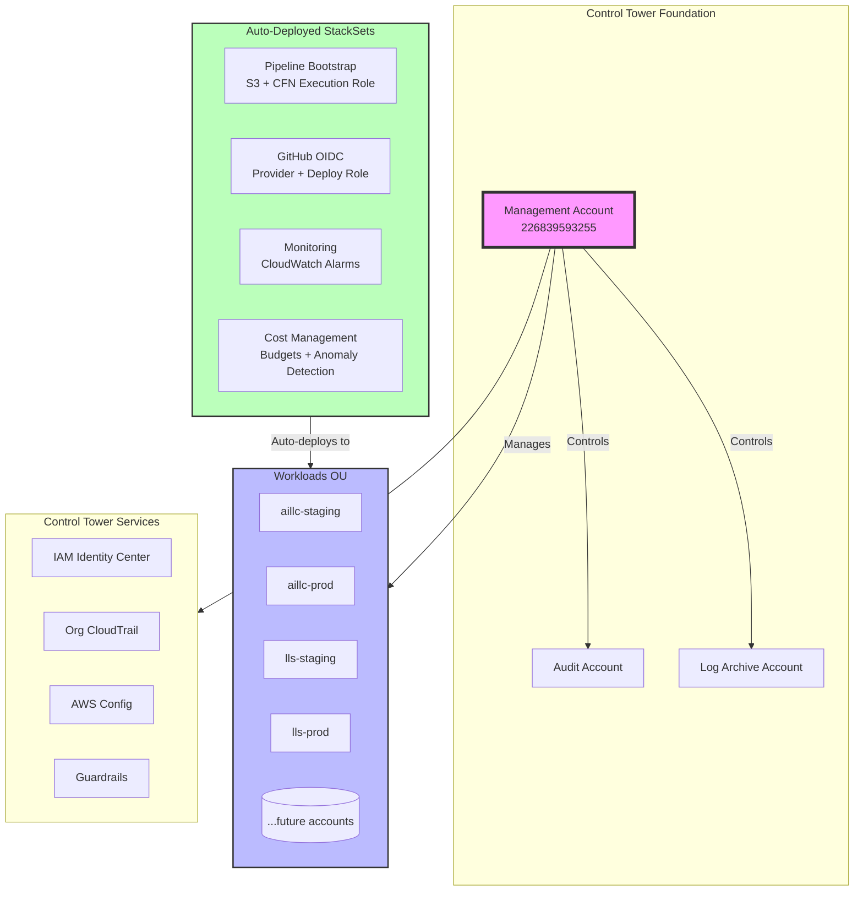
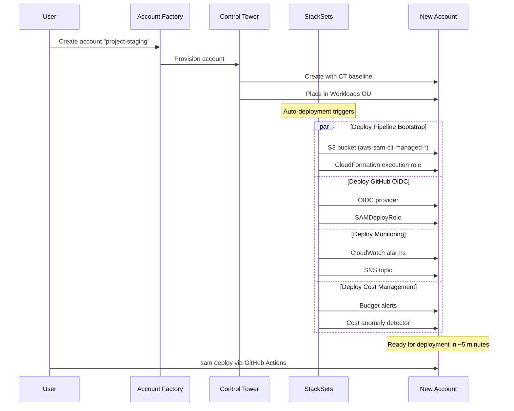
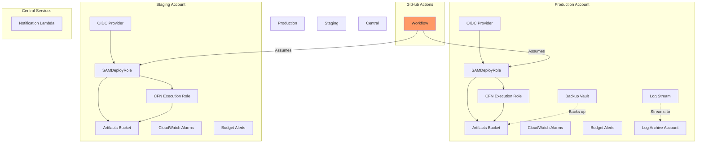
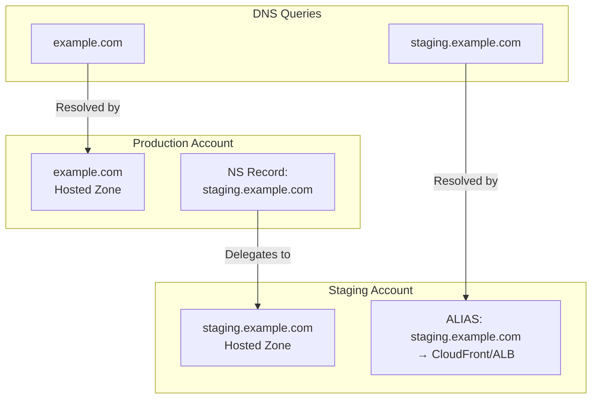
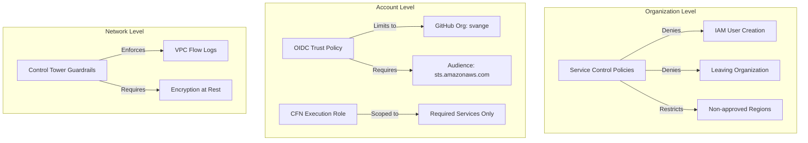

# ARCHITECTURE — Control Tower + Direct StackSets

_Last updated: 2025-09-19_

## System Architecture

## Account Creation Flow

## Resource Relationships

## DNS Architecture (Per Project)

## Key Design Decisions

### 1. Direct StackSets vs CfCT
- **Chosen**: Direct StackSets with auto-deployment
- **Rationale**: Eliminates 30+ CfCT pipeline resources, reduces complexity
- **Trade-off**: Less sophisticated deployment orchestration (acceptable for our scale)

### 2. Account-per-Environment
- **Pattern**: `{project}-staging`, `{project}-prod`
- **Benefits**: Complete isolation, clear billing, easy handoff
- **Cost**: ~$0 (AWS doesn't charge for accounts)

### 3. Auto-Deployment
- **Mechanism**: StackSets with `AutoDeployment=true`
- **Benefit**: Zero-touch account provisioning
- **SLA**: Resources ready in ~5 minutes

### 4. GitHub OIDC vs IAM Users
- **Chosen**: OIDC with short-lived tokens
- **Security**: No long-lived credentials
- **Enforced**: SCP blocks IAM user creation

## Security Boundaries

## Cost Controls

1. **Budget Alerts**: 80% and 100% thresholds per account
2. **Cost Anomaly Detection**: ML-based spike detection
3. **Account Isolation**: Runaway costs contained per environment
4. **Resource Tagging**: Enforced via StackSet parameters

## Monitoring Strategy

### Application Level (Auto-deployed)
- Lambda error rates and throttles
- API Gateway 4xx/5xx rates
- DynamoDB throttles and errors
- All alarms → SNS → Email

### Organization Level (Control Tower)
- CloudTrail for all API calls
- Config for compliance tracking
- GuardDuty for threat detection (optional)
- Security Hub aggregation (optional)

## Scaling Considerations

### Current Scale (Optimized For)
- 5-20 accounts
- 1-5 developers
- 10-50 deployments/day

### Growth Path
- Add per-team OUs when hiring
- Implement CfCT if needing complex workflows
- Add AWS SSO permission sets for granular access
- Consider AWS Control Tower AFT for Terraform users
