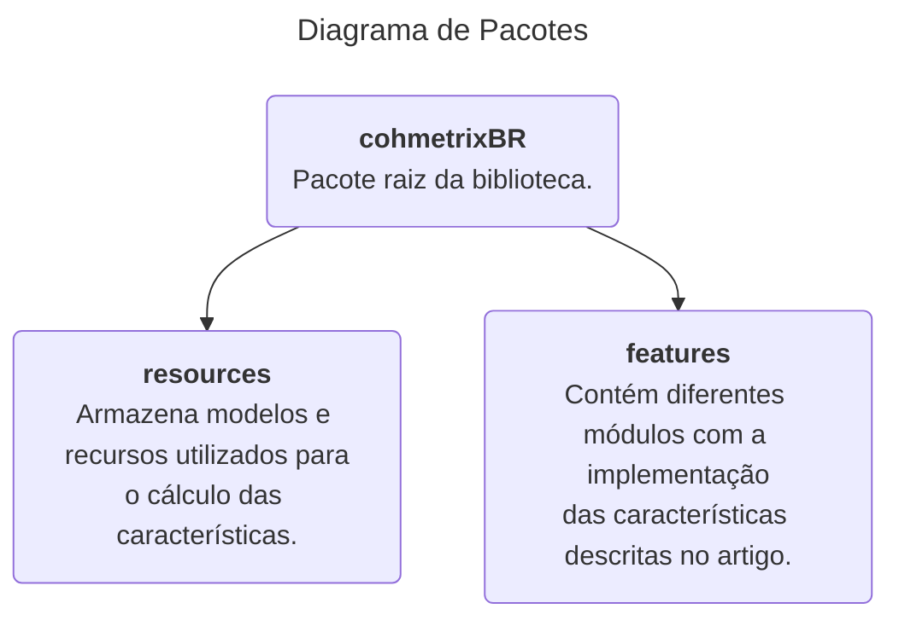

<h1 align="center">
  CohMetrix-BR
  <br>
</h1>

<h4 align="center">Biblioteca para extração de características linguísticas para o Português Brasileiro.</h4>


## Descrição

Esse repositório implementa uma versão em biblioteca da API Web Coh-Metrix BR descrito em ["Coh-Metrix PT-BR: Uma API web de análise textual para a educação (2020)"](https://doi.org/10.5753/cbie.wcbie.2020.179).

Esse é um trabalho em progresso que reimplementa as características como descritas no artigo, todavia permitindo o uso direto em códigos Python.


## Quickstart

A biblioteca é organizada no seguinte formato:



Para utilização, só precisamos importar diretamente o módulo com as características desejadas e invocar a respectiva função. Um exemplo desse processo abaixo:

```python
# Importando o módulo com as
#   características relacionadas à conectivos
from cohmetrixBR.features import connectives

# Calculando a característica CNCAll para um
#   texto qualquer:
connectives.CNCAll('Esse é um texto de exemplo.')
# 0.0
```

Outra forma de utilizar a biblioteca é calculando múltiplas características de uma única vez. Todos os módulos expõem uma variável `FEATURES` que contém a lista de todas as características disponibilizadas naquele módulo. Assim, é possível fazer dessa forma:

```python
# Obtendo todas as características presentes
#   na biblioteca
from cohmetrixBR.features import FEATURES

# Definindo o texto de exemplo
text = "Texto de exemplo para extração de características"

# Calculando todas as características
features = [f(text) for f in FEATURES]
# [1, 1, 1.0, ...,  15.797142857142859, -45.032]
```


## Instalação

Primeiro, realiza a instalação da biblioteca via `pip` ou através do `git clone`:

### 1. Instalando com o pip

```bash
# Configurar ambiente virtual
# ...

# Instalar através do pip
$ pip install cohmetrix-br-lib
```

### 2. Instalando localmente

```bash
# Clonar repositório
$ git clone https://github.com/moesio-f/cohmetrix-br

# Acessar diretório
$ cd cohmetrix-br

# Configurar ambiente virtual
# ...

# Instalar através do pip
$ pip install -e .
```

---
