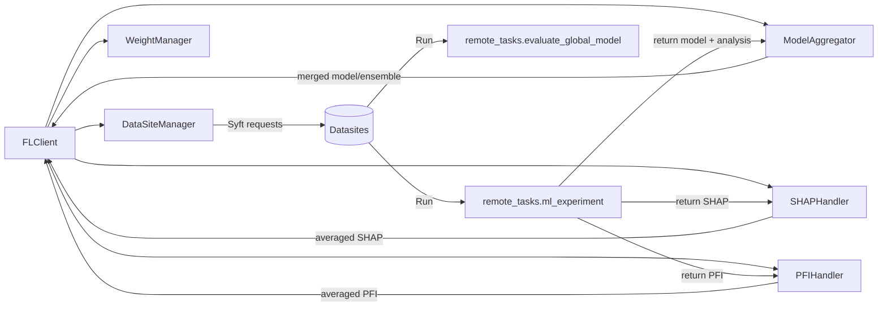

# fed_rf_mk

# Federated Random Forests and XGBoost with PySyft

Privacy-preserving federated learning for tree-based models (RandomForest, XGBoost) using PySyft. Includes orchestration client, datasite server utilities, remote training/evaluation functions, model aggregation, and explainability (SHAP, PFI).
[](https://badge.fury.io/py/fed-rf-mk)
[](https://opensource.org/licenses/MIT)

## Table of Contents
- What’s New
- Overview
- Repository Structure
- Installation
- Quickstart
- Detailed Usage
  - Parameters
  - RandomForest example
  - XGBoost example
- Data
- Models & Experiments
- Outputs & Logging
- Extending the Project
- Troubleshooting / FAQ
- Changelog
- Citation / License / Acknowledgements
- To‑Verify

## What’s New
- Modularized architecture:
  - `remote_tasks.py` for remote `ml_experiment` and `evaluate_global_model`.
  - Orchestrator modules for datasites and weights.
  - Handlers for explainability (SHAP, PFI).
  - Aggregation for RF and evaluation-time ensembling for XGB.
- Configurable explainability:
  - Toggle SHAP/PFI and tune `shap_sample_size`, `pfi_n_repeats`.
- Nested hyperparameters:
  - Use `model_params` for model-specific settings (e.g., XGB’s `learning_rate`, `max_depth`, device).
- Safer utilities:
  - Better logging and guards for datasite IO and request status.
- Tests + CI:
  - Unit tests for weights, aggregation, remote tasks, plus pre-commit hooks and GitHub Actions.

## Overview
This project demonstrates a practical federated learning workflow on top of PySyft. It supports:
- Training RF/XGB on multiple datasites without moving raw data.
- Aggregating models (RF) and evaluating ensembles (XGB).
- Explainability across silos via SHAP and PFI with weighted averaging.

High-level flow:



## Repository Structure
- `package-pysyft/client.py` — FL client orchestrator (connects to datasites, coordinates training/evaluation).
- `package-pysyft/server.py` — server utilities (spawn datasites, manage approvals).
- `package-pysyft/datasites.py` — launch datasites, upload CSV asset, server-side policy toggles.
- `package-pysyft/remote_tasks.py` — remote functions:
  - `ml_experiment(data, dataParams, modelParams)`
  - `evaluate_global_model(data, dataParams, modelParams)`
- `package-pysyft/orchestrator/` — orchestrator modules:
  - `clients.py` — `DataSiteManager` (connect/send requests/check status).
  - `weights.py` — robust `WeightManager` (normalization with None/negative handling).
- `package-pysyft/aggregation/models.py` — `ModelAggregator` (RF estimator merge, XGB ensemble members).
- `package-pysyft/handlers/` — `SHAPHandler`, `PFIHandler`.
- `package-pysyft/analysis/` — notebooks and pipelines, e.g., `2-testing_aids_clinical.ipynb`.
- `tests/` — unit tests for weights, aggregation, remote tasks.
- `.github/workflows/ci.yml` — lint + tests CI.
- `pyproject.toml` — build config and dependencies.

## Installation
Requirement: Python 3.10+

Install dev (recommended for running examples and tests):
```bash
python -m venv .venv
source .venv/bin/activate  # Windows: .venv\Scripts\activate
pip install --upgrade pip
pip install .[dev]
pre-commit install
```

Minimal install:
```bash
pip install .
```

Key runtime deps:
- syft==0.9.1
- pandas>=2.0
- scikit-learn>=1.3
- cloudpickle>=3.0
- shap>=0.44
- xgboost>=2.0

## Quickstart
Start two train datasites and one eval datasite (example ports/paths):

```python
from package_pysyft.server import FLServer
import threading

servers = [
  FLServer("silo1", 8080, "train_datasets/aids_clinical/part_0.csv", auto_accept=True, analysis_allowed=True),
  FLServer("silo2", 8081, "train_datasets/aids_clinical/part_1.csv", auto_accept=True, analysis_allowed=True),
  FLServer("eval_silo", 8082, "train_datasets/aids_clinical/part_2.csv", auto_accept=True, analysis_allowed=True),
]
for s in servers:
    threading.Thread(target=s.start, daemon=True).start()
```

Train and evaluate with the client:

```python
from package_pysyft.client import FLClient

rf_client = FLClient()
rf_client.add_train_client("silo1", "http://localhost:8080", "fedlearning@rf.com", "****", weight=0.6)
rf_client.add_train_client("silo2", "http://localhost:8081", "fedlearning@rf.com", "****", weight=0.4)
rf_client.add_eval_client("eval_silo", "http://localhost:8082", "fedlearning@rf.com", "****")

dataParams = {
  "target": "cid",
  "ignored_columns": ["cid"]
}

# RandomForest example (top-level hyperparams for RF)
modelParams = {
  "model": None,
  "model_type": "rf",
  "n_base_estimators": 100,
  "n_incremental_estimators": 20,
  "train_size": 0.8,
  "test_size": 0.8,
  "fl_epochs": 1,
}

rf_client.set_data_params(dataParams)
rf_client.set_model_params(modelParams)

rf_client.run_model()
results = rf_client.run_evaluate()
print(results)
```

## Detailed Usage

### Parameters

Data Parameters (dataParams)

Name | Type | Default | Description | Example
---|---|---|---|---
target | str | required | Target column name | "cid"
ignored_columns | list[str] | [] | Columns excluded from features | ["cid","id"]

Top-level Model Parameters (modelParams)

Name | Type | Default | Description | Example
---|---|---|---|---
model | bytes or None | None | Serialized seed model (None for cold start) | None
model_type | str | "rf" | "rf" or "xgb" | "xgb"
n_base_estimators | int | required | Base number of trees | 200
n_incremental_estimators | int | 0 | Extra trees for warm-start | 50
train_size | float | 0.8 | Train split ratio on each site | 0.7
test_size | float | 0.2 | Eval split ratio (use 1.0 for eval silos) | 1.0
fl_epochs | int | 1 | Global rounds | 1
allow_analysis | bool | False | Gate SHAP/PFI analysis (and server policy) | True
analysis | dict | {} | Fine-grained analysis config (see below) | {"enabled":True,...}
model_params | dict | {} | Model-specific hyperparameters (nested) | {"max_depth":6,...}


RandomForest Hyperparameters (modelParams)

Name | Type | Default | Description | Example
---|---|---|---|---
criterion | str | "gini" | Split criterion | "entropy"
max_depth | int or None | None | Max tree depth | 12
min_samples_split | int | 2 | Min samples to split | 2
min_samples_leaf | int | 1 | Min samples per leaf | 1
max_features | str or int | "sqrt" | Features per split | "sqrt"
bootstrap | bool | True | Bootstrap samples | True
n_jobs | int or None | None | Threads | -1
… | … | … | Additional sklearn RF kwargs supported | …

XGBoost Hyperparameters (modelParams)

Name | Type | Default | Description | Example
---|---|---|---|---
device | str | "cpu" | "cpu" or "cuda" | "cuda"
verbosity | int | 1 | 0–3 | 1
validate_parameters | bool | True | Validate input params | True
disable_default_eval_metric | bool | False | Disable default metric | False
learning_rate | float | 0.1 | Eta | 0.05
max_depth | int | 6 | Max depth | 8
min_child_weight | float | 1 | Min child weight | 1
gamma | float | 0 | Min split loss | 0
subsample | float | 1.0 | Row subsampling | 0.8
colsample_bytree | float | 1.0 | Col subsampling per tree | 0.8
colsample_bylevel | float | 1.0 | Col subsampling per level | 1.0
colsample_bynode | float | 1.0 | Col subsampling per node | 1.0
reg_lambda | float | 1.0 | L2 regularization | 1.0
reg_alpha | float | 0.0 | L1 regularization | 0.0
tree_method | str | "auto" | "hist","approx","exact","auto" | "hist"
max_delta_step | float | 0 | Max delta step | 0
scale_pos_weight | float | 1.0 | Class imbalance control | 1.0
booster | str | "gbtree" | Booster type | "gbtree"
grow_policy | str | "depthwise" | "depthwise" or "lossguide" | "depthwise"
max_leaves | int | 0 | Max leaves | 0
max_bin | int | 256 | Histogram bins | 256
sampling_method | str | "uniform" | "uniform" or "gradient_based" | "uniform"
Optional | various | N/A | `updater`, `refresh_leaf`, `process_type`, `num_parallel_tree`, `monotone_constraints`, `interaction_constraints`, `multi_strategy` | see XGB docs

### RandomForest example

```python
from package_pysyft.client import FLClient
rf_client = FLClient()

# connect clients (see Quickstart)
# ...

dataParams = {"target": "cid", "ignored_columns": ["cid"]}
modelParams = {
  "model": None,
  "model_type": "rf",
  "n_base_estimators": 150,
  "n_incremental_estimators": 30,
  "train_size": 0.8,
  "test_size": 0.8,
  "fl_epochs": 1,
  "allow_analysis": True,
  "max_depth": 10, 
  "max_features": "sqrt", 
  "bootstrap": True, 
}
rf_client.set_data_params(dataParams)
rf_client.set_model_params(modelParams)
rf_client.run_model()
print(rf_client.run_evaluate())
```

### XGBoost example

```python
from package_pysyft.client import FLClient
xgb_client = FLClient()

# connect clients (see Quickstart)
# ...

dataParams = {"target": "cid", "ignored_columns": ["cid"]}
modelParams = {
    "model": None,
    "model_type": "xgb",
    "n_base_estimators": 200,
    "n_incremental_estimators": 50,
    "train_size": 0.8,
    "test_size": 0.8,
    "fl_epochs": 1,
    "allow_analysis": True,
    "device": "cpu",  # or "cuda"
    "learning_rate": 0.1,
    "max_depth": 8,
    "subsample": 0.8,
    "colsample_bytree": 0.8,
    "tree_method": "hist",
    "verbosity": 1,
    "validate_parameters": True

}
xgb_client.set_data_params(dataParams)
xgb_client.set_model_params(modelParams)
xgb_client.run_model()
print(xgb_client.run_evaluate())
```

## Data
- Input: CSV files per datasite with consistent schema.
- `dataParams["target"]` must exist in all files; `ignored_columns` are dropped from features.
- `datasites.py` uploads a single asset called "Asset" by default (first dataset/asset is used in examples).

## Models & Experiments
- RandomForest:
  - Training: local RF per silo; aggregation merges estimators proportionally to normalized weights.
  - Warm-start: `n_incremental_estimators` grows trees for subsequent rounds.
- XGBoost:
  - Training: XGB per silo; for continuation, the booster is reused and `n_estimators` is increased.
  - Evaluation: weighted margin (logit) averaging of ensemble members; picks best-weight seed for next round.

Explainability:
- SHAP: mean absolute SHAP per feature; averaged across silos using normalized weights.
- PFI: permutation importance on eval split; mean/std per feature; averaged across silos.

## Outputs & Logging
- Remote training returns:
  - `"model"` (serialized), `"model_type"`, sizes, and optionally `"shap_data"`, `"pfi_data"`.
- Client logs progress; datasites log request approvals. Arrays in SHAP/PFI are normalized to Python floats for downstream use.

## Extending the Project
- Add new model types by:
  - Updating `remote_tasks.ml_experiment` to construct and train the model.
  - Extending `ModelAggregator` for aggregation/ensembling semantics.
- Add new explainability methods through handlers similar to SHAP/PFI.

## Troubleshooting / FAQ
- Evaluate fails with “Reference don’t match: dict”
  - Ensure evaluation function is available on datasite. The client has a fallback that creates a syft function ad-hoc if missing; confirm your server auto-accepts or approve requests manually.
- Missing packages
  - Install with `pip install .[dev]` to get all deps (including shap/xgboost).
- SHAP/PFI slow
  - Reduce `analysis.shap_sample_size` or `analysis.pfi_n_repeats`, or disable via `analysis.enabled=False`.

## Changelog
- 0.2.0 (2025-09-06)
  - Modular orchestrator/handlers/aggregation
  - Nested `model_params` support for RF/XGB
  - Explainability controls (SHAP/PFI) and parameters
  - Safer datasite loading + logging, fallback eval registration
  - Tests + CI, pre-commit hooks

## Citation / License / Acknowledgements
- License: MIT
- Built with:
  - [PySyft](https://github.com/OpenMined/PySyft)
  - [scikit-learn](https://scikit-learn.org/)
  - [XGBoost](https://xgboost.readthedocs.io/)
  - [SHAP](https://shap.readthedocs.io/)
