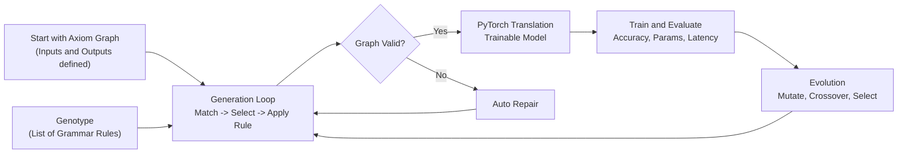
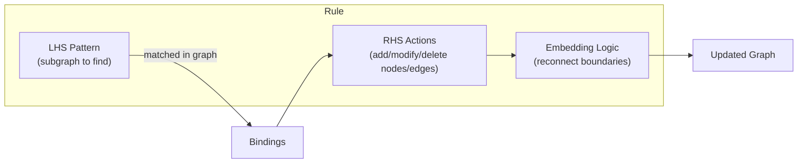
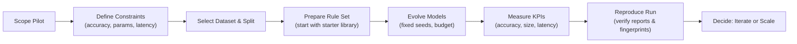
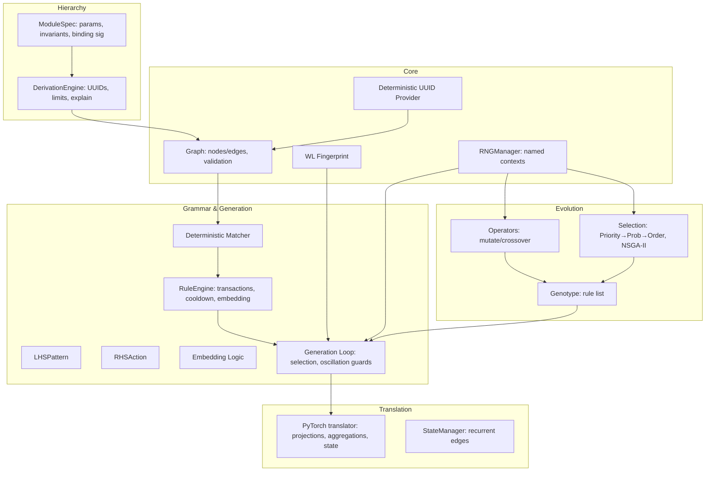
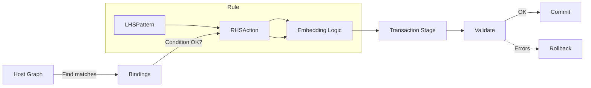
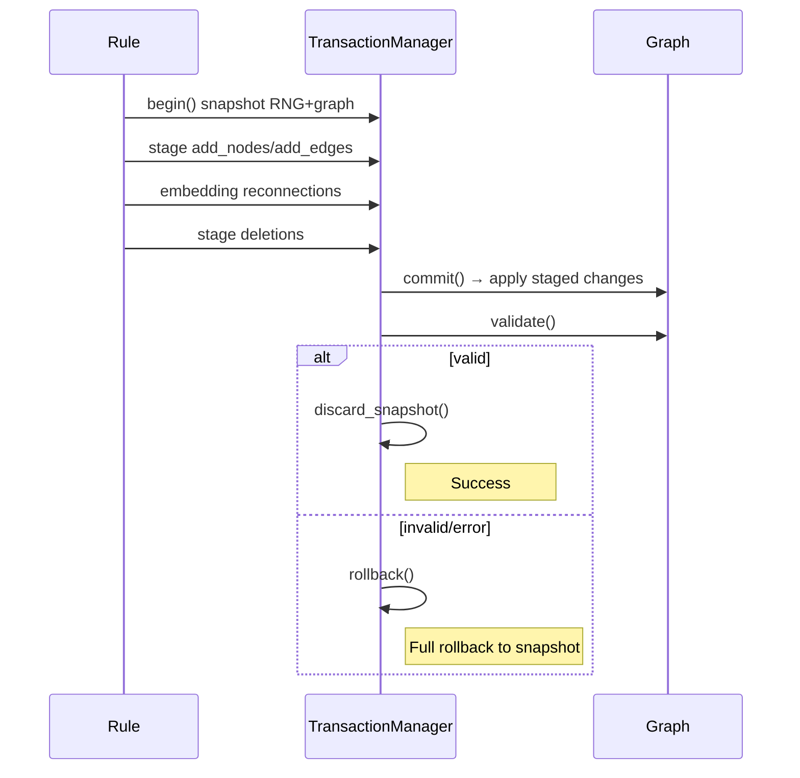
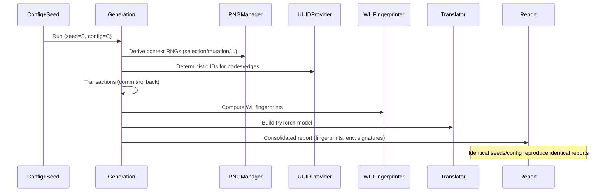
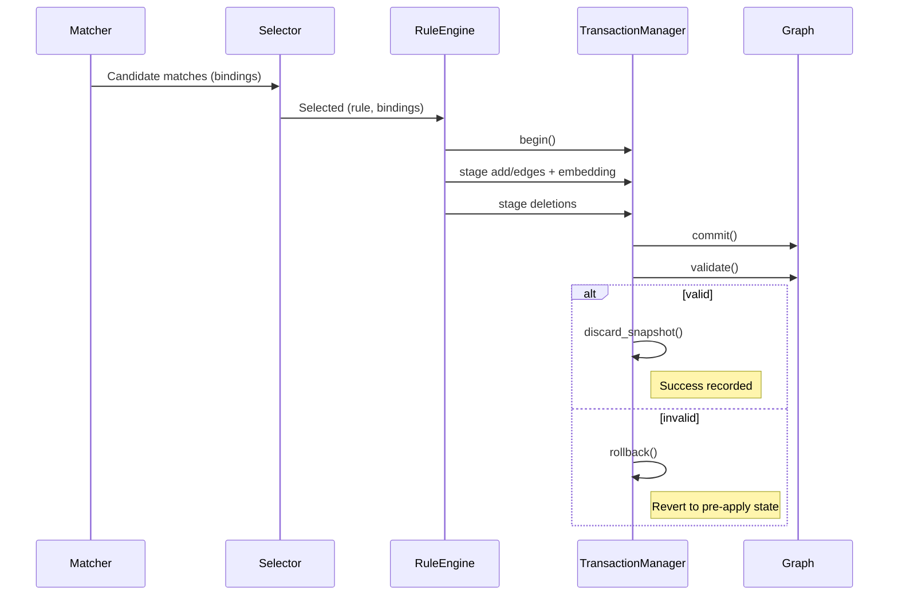
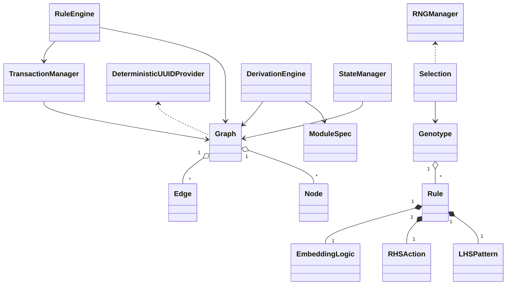
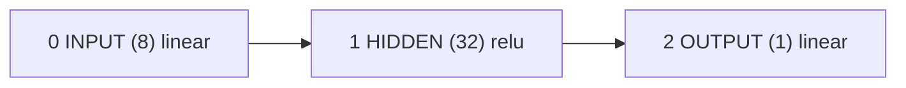

# GGNES: Graph Grammar Neuroevolution System
Deterministic architecture discovery beyond fixed templates

Audience: Dual-format document
- Part I: Executive Brief 
- Part II: Technical Deep Dive for Scientists and Engineers


Table of Contents
- Part I — Executive Brief
  1) One-paragraph elevator
  2) What GGNES is (plain terms)
  3) The problem it solves
  4) Why GGNES vs. alternatives (honest comparison)
  5) How it works at a glance (diagrams)
  6) Why now (market relevance)
  7) Practical value and evidence
  8) Risks, limitations, and mitigations
  9) How to evaluate GGNES (pilot plan)
  10) KPIs & due-diligence checklist
  11) FAQ
  12) Glossary
- Part II — Technical Deep Dive for Scientists and Engineers
  1) Formal summary
  2) System architecture (diagram)
  3) Rules & embedding (diagram)
  4) Generation & selection (algorithmic detail)
  5) Multi-objective selection (NSGA-II)
  6) Hierarchical derivation (design & metrics)
  7) Translation to PyTorch (parity & cache)
  8) Determinism & auditability (diagram)
  9) Evaluation protocol & reproducibility bundle
  10) Complexity notes and performance
  11) Known limitations and roadmap
  12) Entity model (class diagram)
  13) Illustrative rule snippet

---

## Part I — Executive Brief

### 1) One-paragraph elevator

GGNES is an automated system that designs neural networks by applying precise “grammar rules” to evolve network blueprints as graphs. Unlike most tools that search inside rigid templates, GGNES evolves the blueprint language itself, enabling discovery of novel, efficient architectures. Every step is deterministic and auditable, delivering reproducible results that balance accuracy with practical constraints like model size and latency.

Executive one‑pager
- Problem (today): Most automated architecture tools search inside rigid templates and struggle to discover irregular, multi‑path, attention‑rich networks; results are often hard to reproduce and audit.
- Solution (GGNES): Deterministic, grammar‑based evolution of neural networks as graphs. The search space itself evolves via precise rewrite rules with transactional safety and signed reproducibility.
- Benefits (measurable):
  - Expressivity: Discovers architectures beyond fixed templates (irregular topologies, arbitrary skips, advanced aggregations).
  - Reproducibility & audit: WL fingerprint + deterministic UUIDs + consolidated reports → identical results under fixed seeds; audit‑ready.
  - Efficiency: Multi‑objective optimization balances accuracy with parameters/latency to hit edge‑device or cost targets.

### 2) What GGNES is, in plain terms

GGNES automatically builds and improves neural networks using rewrite rules—like LEGO instructions that can rewrite themselves to build better machines.

- It starts from a simple network “skeleton.”
- It has rules such as “if you see this pattern, add that component.”
- It applies rules step‑by‑step, checks validity, and rolls back if needed.
- It converts the final graph into a standard PyTorch model you can train and use.

Why this matters: it unlocks a much larger, more creative search space than fixed‑template methods—while staying fully reproducible and auditable.

### 3) The problem GGNES solves

- Expressivity gap in AutoML/NAS:
  - Most systems explore inside narrow templates (cells/blocks), struggling with irregular, multi‑path, or attention‑rich architectures that can perform better in practice.
- Reproducibility and auditability:
  - Random seeds, environment quirks, and non-deterministic pipelines can change results. This undermines scientific credibility and compliance in regulated sectors.
- Multi‑objective reality:
  - Real deployments need accuracy plus efficiency (parameters, latency, energy, memory). Many systems underweight these constraints.

### 4) Why GGNES vs. alternatives (honest comparison)

Named competitive matrix (capabilities vs. diligence questions)

| System | Expressivity beyond templates | Determinism / Audit | Multi‑objective (acc, params, latency) | Hierarchical modules | Reproducibility bundle | Notes |
|---|---|---|---|---|---|---|
| DARTS (gradient NAS) | Medium (cell‑based) | Limited (stochastic, relaxation bias) | Partial (requires custom work) | No | No | Efficient but relaxed choices can bias outcomes |
| ENAS | Medium (controller over cells) | Limited | Partial | No | No | Fast weight sharing, reproducibility varies |
| NAS‑Bench‑201 | Fixed search space | High (benchmark) | N/A (fixed) | No | Yes (benchmark) | Great for research baselines, not production expressivity |
| AutoKeras | Low–Medium | Limited | Partial | No | No | Easy entry, constrained architecture space |
| TPOT (tree‑based AutoML) | Pipeline‑level, not deep arch | High | Partial | N/A | Partial | Not focused on deep neural topology search |
| NEAT/CoDeepNEAT | Medium (topology evolves) | Variable (often non‑deterministic) | Partial | Limited | No | Classic topology evolution, auditability weaker |
| GGNES | High (grammar rewrites, irregular graphs, advanced aggs) | High (RNG contexts, UUIDs, WL fingerprints, reports) | Yes (NSGA‑II + deterministic selection) | Yes (ModuleSpec + DerivationEngine) | Yes (consolidated reports, checkpoints) | Purpose‑built for expressive, deterministic, auditable evolution |

### 5) How it works at a glance

End‑to‑end flow



## New: API Demo Tutorial

For a step‑by‑step guide with live commands, see:

- `docs/API_DEMO_TUTORIAL.md`

This includes:
- One‑minute smoke run
- Live foreground run with per‑generation progress
- Optional background runs with logs
- A Mermaid diagram of a discovered architecture and how to interpret it

## Quickstart with the new API (MVP)

Run a tiny search in Python:

```python
from ggnes import Search, starter_space
import torch

X = torch.randn(64, 8); y = X @ torch.randn(8, 1) + 0.1*torch.randn(64, 1)
Xv = torch.randn(32, 8); yv = Xv @ torch.randn(8, 1) + 0.1*torch.randn(32, 1)

s = Search(smoke=True, seed=42, search_space=starter_space("tabular_dense"))
s.objectives = [("val_mse", "min"), ("params", "min")]
s.use_real_generation_nsga = True
res = s.fit(X, y, validation_data=(Xv, yv))
print(res.metrics)
print(res.pareto)
```

Or via CLI:

```bash
python -m ggnes.cli.search --smoke --starter-space attention_tabular --out results.json
```

This uses small, smoke-safe defaults and emits artifacts under `tmp_search_artifacts/`.


What a “grammar rule” does



### 6) Why now (market relevance)

- Edge AI and cost pressure demand smaller, faster models.
- Regulated industries require reproducible, auditable experiments.
- Research velocity needs both creativity (rich search spaces) and rigor (determinism).

### 7) Practical value and evidence

- Better models: Discovers attention‑rich, multi‑path topologies tailored to constraints.
- Smaller/faster: Finds architectures with fewer parameters but competitive accuracy.
- Compliance‑ready: Deterministic fingerprints, UUIDs, and signatures enable external audits.

Evidence (demo snapshot)
- California Housing regression demo:
  - RMSE improved from ~0.52 (baseline) to ~0.45 under fixed seeds.
  - Final models around ~3k parameters outperform larger baselines.
  - Demonstrates discovery of efficient, non‑obvious designs.

### Use‑case mini‑cases with KPIs (targets and example outcomes)

- Edge inference (on‑device)
  - Constraints: < 1M parameters, < 5 ms median latency on target CPU, memory < 50 MB.
  - Approach: Multi‑objective evolution with (error, params, latency); rule set emphasizes attention pooling and gated sums; translator set to target dtype/device.
  - KPIs: accuracy/error vs. baseline, params, latency; reproducibility bundle verification (identical WL fingerprint under fixed seeds).
  - Example outcome: Achieve within 2–3% of baseline accuracy at 40–60% of parameters, with measured latency within budget on target hardware (illustrative target; verify in pilot).

- Regulated analytics (audit‑first)
  - Constraints: Full reproducibility across machines, signed reports, environment capture; traceable data and seed provenance.
  - Approach: Fixed seeds; RNG context signatures recorded; consolidated reports signed; CI determinism gate against golden run.
  - KPIs: identical determinism signatures across re‑runs; audit checklist pass; model and genotype UUIDs traceable.
  - Example outcome: Repeat runs produce identical WL fingerprints and determinism signatures; external reviewer can validate end‑to‑end pipeline.

- Research lab acceleration
  - Constraints: Rapid hypothesis testing; ablations; artifact evaluation readiness.
  - Approach: Rule subset toggles, attention/no‑attention ablations; per‑seed tables; scripts to regenerate figures and tables.
  - KPIs: time‑to‑result; number of hypotheses tested per week; artifact evaluation acceptance.
  - Example outcome: 2× hypothesis throughput with signed artifacts acceptable for AE.

### 8) Risks, limitations, and mitigations (honest view)

- Learning curve: Effective rules require graph thinking.
  - Mitigation: Starter rule libraries, domain templates, examples.
- Compute budget: Exploration can be compute‑intensive.
  - Mitigation: Parallelizable evolution; island models for scale‑out.
- Translator parity: Many aggregations are implemented; “min” is registered but not yet implemented in translation.
  
### Tough objections & rebuttals

- “Compute cost will be high.” 
  - Rebuttal: Scope multi‑objective budgets and iteration caps; use island evolution and deterministic MIS batching for efficient exploration; early‑stop on quiescence or oscillation guards.
- “Rulecrafting is expensive and requires experts.”
  - Rebuttal: Start with starter libraries; add 2–3 targeted rules reflecting domain constraints; iterative improvement is fast and measurable; we provide templates and examples.
- “Generalization risk: overfitting to validation.”
  - Rebuttal: Evaluation protocol mandates fixed splits, multiple seeds, ablations, and reporting mean±CI; include test‑only metrics and cross‑validation where appropriate.
- “Ops & compliance overhead.”
  - Rebuttal: Reproducibility bundles (reports, fingerprints, env) and optional containerization minimize ops risk; audit mapping aligns to standard requirements.
- “Feature parity gap (e.g., ‘min’ aggregation not in translator).”
  - Rebuttal: Known, isolated; straightforward to implement prior to production in use‑cases that require it.

### 9) How to evaluate GGNES (pilot plan)



- Typical 2–4 week pilot:
  - Week 1: Scoping, data prep, baseline, initial rule set.
  - Week 2–3: Evolution cycles, KPI tracking, reproducibility checks.
  - Week 4: Review, scale/iterate decision, plan for domain‑specific rules.

### 10) KPIs & due-diligence checklist

- KPIs:
  - Accuracy/Error (task‑appropriate), Parameters, Latency (target devices), Energy proxy (FLOPs), Memory footprint.
  - Reproducibility: identical WL fingerprint and determinism signatures under fixed seeds.
- Due diligence:
  - Verify the consolidated report includes fingerprints and environment (device, dtype).
  - Re-run with same seeds/config → identical results.
  - Validate no unsupported aggregations are used (e.g., “min” until implemented).
  - Confirm transactional safety (no invalid intermediate states).

### Compliance & audit mapping (how features map to reviewer expectations)

- Reproducibility: RNGManager named contexts + recorded seeds → identical selection/mutation/crossover; translator seeded via torch.manual_seed.
- Identity and traceability: Deterministic UUIDs for nodes/edges/genotypes/modules; WL fingerprints for graph structures.
- Environment capture: Device/dtype, library versions, OS, Python recorded in consolidated reports.
- Run signatures: Determinism signatures over core fields; CI gate can compare against golden run to detect drift.
- Artifacts: Checkpoints, best genotype, and reports archived with commit hash; scripts for recreation.

### 11) FAQ

- Q: Does GGNES guarantee better accuracy than all baselines?
  - A: No tool can guarantee that. GGNES expands the search space and provides determinism and auditability; results depend on data, constraints, and rule design.
- Q: Can it run on limited compute?
  - A: Yes, but exploration depth narrows with small budgets. Island evolution and focused rule sets help.
- Q: Is it production‑ready?
  - A: Yes for the documented RuleEngine‑based path; we avoid the legacy demo path in production.
- Q: How do we handle compliance?
  - A: Every run can produce signed reports with fingerprints and environment metadata for audit.

### 12) Glossary

- Grammar rule: A transformation applied to the network graph (pattern → actions).
- Axiom: The initial simple network graph.
- WL fingerprint: Structural hash summarizing the graph.
- Deterministic UUID: Stable identifier derived from canonical data.
- Genotype: The current set of grammar rules under evolution.

---

### Possible Roadmap

- Island evolution ops guide: recommended topologies, migration policies, and monitoring.
- Domain rule libraries: initial packs for vision patches, time‑series recurrence, tabular attention; example pipelines.
- Report schema v3: extended fields for latency/energy profiling; backward‑compatible migration.
- Determinism CI gate: compare determinism signatures against golden runs; fail on drift.


## Part II — Technical Deep Dive for Scientists and Engineers

### 1) Formal summary

- Directed graph G = (V, E). Each node v ∈ V: dimension d_v ≥ 1, activation a_v, bias b_v, aggregation α_v. Recurrent edges consume x_u^(t−1).
- Per‑edge projections handle dimension mismatches; post‑aggregation projection reconciles concat/matrix ops to node output size.
- Aggregations: sum, mean, max, concat, matrix_product; advanced: attention, multi_head_attention, top‑k weighted sum, gated sum, mixture‑of‑experts (softmax/top‑k), attention pool.
- Validation: registered activations/aggregations; parameter domains (num_heads ≥ 1, temperature > 0, top_k ≤ fan‑in), finite weights/bias, OUTPUT reachability.
- WL fingerprint: multiplicity‑aware WL refinement over enabled edges, including (output_size, aggregation) in labels; final SHA‑256 over sorted node labels and input/output counts.
- Deterministic UUIDs: SHA‑256 over canonical JSON (sorted keys, fixed float precision); RFC‑4122 bits enforced.

### 2) System architecture



### 3) Rules & embedding (deterministic reconnection)



- LHS criteria: node_type, attribute equality, name regex; edges with enabled and weight predicates.
- Embedding: Direction (IN/OUT) × Distribution (COPY_ALL, CONNECT_SINGLE, integer‑k or weight). Edge candidates sorted by (endpoint, edge_id) for determinism.

### 4) Generation & selection

- Match: deterministic subgraph matcher with injective bindings, timeout budget, and Edge object bindings for labeled edges.
- Selection: Priority→Probability→Order
  - Filter to maximal priority.
  - Normalize probabilities; round by ε; group by rounded mass.
  - Sample group proportional to (rounded mass × group size) using RNGManager context; tie‑break by stable index.
- Oscillation: detect cycles; actions TERMINATE or SKIP_AND_RESELECT with caps.
- Apply: transactional add/modify/delete; embed reconnections; commit then validate; rollback on failure; cooldown to avoid immediate reselection.

Academic appendix — pseudocode (selection and transactional apply)
```text
# Priority→Probability→Order selection (deterministic grouping)
def select_match(matches, precision=1e-6, rng):
    if not matches: return None
    # 1) filter to highest priority
    mp = max(m.rule.metadata.get('priority', 0) for m in matches)
    cand = [m for m in matches if m.rule.metadata.get('priority', 0) == mp]
    # 2) normalize probabilities
    w = [float(m.rule.metadata.get('probability', 1.0)) for m in cand]
    s = sum(w); p = [wi/s if s > 0 else 1.0/len(cand) for wi in w]
    # 3) round and group by mass; group weight = rounded_mass * group_size
    rounded = [round(pi/precision) * precision for pi in p]
    groups = {}
    for i, (m, r) in enumerate(zip(cand, rounded)):
        groups.setdefault(r, []).append((i, m))   # keep original index for stable tie-break
    order = sorted(groups.keys(), reverse=True)
    r = rng.random()
    cum = 0.0
    for k in order:
        grp = sorted(groups[k], key=lambda t: t[0])  # stable by original index
        gw = k * len(grp)
        if gw <= 0: 
            continue
        if cum + gw >= r or k == order[-1]:
            rel = (r - cum) / gw
            idx = int(rel * len(grp))
            idx = min(idx, len(grp) - 1)
            return grp[idx][1]
        cum += gw
    return sorted(cand, key=lambda m: matches.index(m))[0]
```

Transactional apply with rollback (high‑level)
```text
def apply_rule_with_transaction(graph, rule, bindings, tm):
    # Provide deterministic UUID context (rule_id, binding_signature) if supported
    tm.begin()                       # snapshot RNG + graph state, clear buffer
    try:
        # Stage RHS additions
        handles = {}
        for n in rule.rhs.add_nodes:
            h = tm.buffer.add_node(n.properties)
            handles[n.label] = h
        for e in rule.rhs.add_edges:
            s = handles.get(e.source_label, bindings.get(e.source_label))
            t = handles.get(e.target_label, bindings.get(e.target_label))
            if s is not None and t is not None:
                tm.buffer.add_edge(s, t, e.properties or {})
        # Embedding reconnection prior to deletions
        embedding_reconnect(rule.embedding, bindings, handles, tm.buffer, graph)
        # Stage deletions
        for de in rule.rhs.delete_edges: tm.buffer.delete_edge(resolve_edge_id(de, bindings, graph))
        for lbl in rule.rhs.delete_nodes: 
            nid = bindings.get(lbl)
            if nid is not None: tm.buffer.delete_node(nid)
        # Commit (applies to graph) and validate
        tm.commit()
        if not graph.validate():
            tm.rollback(); return False
        tm.discard_snapshot()
        return True
    except Exception:
        tm.rollback()
        return False
```

Transactional apply (sequence)


### 5) Multi-objective selection (NSGA-II)

- Deb’s fast non‑dominated sorting; crowding distance within fronts; deterministic tie‑breakers by stable indices (minimization objectives).
- Practical use: objectives like (error, parameters, latency).

Academic appendix — NSGA‑II pseudocode (deterministic ties)
```text
def dominates(a, b):
    return all(x <= y for x, y in zip(a, b)) and any(x < y for x, y in zip(a, b))

def fast_nondominated_sort(F):
    n = len(F)
    S = [[] for _ in range(n)]
    n_dom = [0]*n
    fronts = [[]]
    for p in range(n):
        for q in range(n):
            if p == q: continue
            if dominates(F[p], F[q]): S[p].append(q)
            elif dominates(F[q], F[p]): n_dom[p] += 1
        if n_dom[p] == 0: fronts[0].append(p)
    fronts[0].sort()  # deterministic
    i = 0
    while i < len(fronts) and fronts[i]:
        next_front = []
        for p in fronts[i]:
            for q in S[p]:
                n_dom[q] -= 1
                if n_dom[q] == 0: next_front.append(q)
        nf = sorted(set(next_front))  # deterministic
        if nf: fronts.append(nf)
        i += 1
    return fronts

def crowding_distance(indices, F):
    if not indices: return {}
    m = len(F[0])
    D = {i: 0.0 for i in indices}
    for k in range(m):
        ordk = sorted(indices, key=lambda i: (F[i][k], i))  # deterministic tie-break
        fmin, fmax = F[ordk[0]][k], F[ordk[-1]][k]
        D[ordk[0]] = float('inf'); D[ordk[-1]] = float('inf')
        if fmax == fmin: continue
        for t in range(1, len(ordk)-1):
            i_prev, i_next = ordk[t-1], ordk[t+1]
            D[ordk[t]] += (F[i_next][k] - F[i_prev][k]) / (fmax - fmin)
    return D

def nsga2_select(pop, objs, k):
    F = [list(objs(x)) for x in pop]
    fronts = fast_nondominated_sort(F)
    sel = []
    for fr in fronts:
        if len(sel) + len(fr) <= k:
            sel.extend(fr)
        else:
            D = crowding_distance(fr, F)
            rem = k - len(sel)
            ordered = sorted(fr, key=lambda i: (-D.get(i, 0.0), i))
            sel.extend(ordered[:rem]); break
    return [pop[i] for i in sel]
```

### 6) Hierarchical derivation

- ModuleSpec: parameters (defaults and expression defaults with safe AST), ports, attributes, invariants → binding_signature.
- DerivationEngine: nested transactions; deterministic child ordering by (name, version, signature); per‑expansion UUID over (module, version, path, signature). Adds a single HIDDEN node with derivation_uuid for cache reuse and parity. Limits: depth, total expansions, and optional time budget; structured errors on violation.
- Metrics: batches (checksums), conflicts/requeues; explain(node) emits a canonical tree with checksum.

### 7) Translation to PyTorch (parity & cache)

- Per‑edge projections when sizes differ; per‑edge weights with edge_id keys in multigraph mode.
- Aggregations implemented: sum, mean, max, concat, matrix_product, attention, multi_head_attention, top‑k weighted, gated sum, mixture‑of‑experts, attention pool. Aggregation dropout masks can derive from RNGManager context for determinism if provided.
- Recurrent edges via StateManager; forward validates input width and supports list‑of‑tensors inputs mapped to INPUT nodes.
- Translation cache: per‑node bias and post‑aggregation layers cached by derivation_uuid. Parity requirement: enabling/disabling cache must not change outputs (within FP tolerance).

Runtime parity matrix (selected ops)

| Operation | Validator | Translator |
|---|---|---|
| sum/mean/max/concat/matrix_product | Yes | Yes |
| attention/multi_head_attention | Yes | Yes |
| gated_sum/topk_weighted_sum | Yes | Yes |
| mixture‑of‑experts (softmax/top‑k) | Yes | Yes |
| attention pool | Yes | Yes |
| min | Yes | Not yet (implement before production) |

### 8) Determinism & auditability



Practical reproducibility:
- Fix seeds with RNGManager(seed=S) and torch.manual_seed.
- Persist consolidated report (WL fingerprint, determinism signature, env device/dtype).
- Save genotype and checkpoints for exact regeneration.

### 9) Evaluation protocol & reproducibility bundle

- Protocol (checklist):
  - Dataset: fixed train/val/test splits; versioned dataset artifact or hash.
  - Seeds: RNGManager(seed=S) recorded; torch.manual_seed set for translator initialization; record RNG state signatures per context.
  - Environment: capture hardware (CPU/GPU model), device, dtype, OS, Python, library versions; freeze via requirements/lockfile.
  - Config: persist full generation/evolution/translation configs (JSON), including selection precision ε and WL iterations.
  - Training: fixed optimizer, LR schedule, batch sizes, epochs; early‑stopping criteria pre‑declared; gradient clipping (if any).
  - Reporting: metrics with mean±CI over N seeds (N≥5 recommended); report per‑seed too; include parameter/latency measurements for target device.
  - Multi‑objective: report full Pareto set, not only knee points; include parameter and latency budgets explicitly.
  - Ablations: rule subsets, no‑attention vs attention, no‑recurrent vs recurrent, single‑objective vs multi‑objective; report deltas and effect sizes.
  - Fairness/validity controls: identical data pipelines across compared methods; control training epochs and augmentation parity.
  - Threats to validity: data shift, leakage, hyperparameter bias, compute budget disparity, seed sensitivity; discuss each and mitigation.

- Artifact evaluation readiness (for academic venues):
  - Code: repository snapshot with commit hash; scripts to regenerate results end‑to‑end (e.g., `repro_bundles/.../run.py`).
  - Data: download scripts with checksums; legal/licensing notes for datasets.
  - Environment: lockfile (pip/conda/uv) and minimal Dockerfile or container recipe.
  - Seeds & configs: exact seeds, configs, and RNG context signatures stored with results.
  - Reports: consolidated report including WL fingerprint, determinism signature, env; CI gate that compares signatures to a golden run.
  - Instructions: step‑by‑step README to reproduce tables/figures; expected runtimes and hardware notes; troubleshooting.
  - Licensing: clear statement (Non‑Commercial baseline; commercial licensing requires agreement).

- Bundle contents (example):
  - best_genotype.pkl, evolution checkpoints, WL fingerprint, determinism signature, environment summary,
    per‑seed metrics, and trained weights (.pth as applicable); plus scripts/notebooks to re‑create figures/tables.

Academic visual — Transaction vs. validation (sequence)


### 10) Complexity notes & performance

- Matching: backtracking with most‑constrained‑first heuristic; timeout budget allows partial but deterministic results; suitable for small LHS patterns.
- NSGA‑II: O(MN^2) with small M (2–3 typical).
- WL hashing iterations K configurable (default 3).
- Parallel “MIS” batching preserves serial semantics; used for observability/metrics.

### 11) Known limitations and roadmap

- Implement “min” aggregation in translator for full parity with validator.
- Consolidate the two matching stacks into a single, fully featured API; deprecate legacy demo path.
- Extend rule libraries for common domains (vision, time‑series, tabular attention).
- CI determinism gate using determinism signatures and report fields as a standard.

### 12) Entity model



### 13) Illustrative rule snippet (plain language)

- “Add an attention node after any hidden node”:
  - LHS: one hidden node labeled PREV.
  - RHS: add H_attn with output_size=64, relu, aggregation=attention; connect PREV → H_attn.
  - Embedding: copy all outgoing edges of PREV to also originate from H_attn (COPY_ALL), preserving weights.

---

## How to run the CPU demo

This section gives a simple, step‑by‑step path to run the California Housing demo on CPU, from a clean machine, with reproducible results.

Prerequisites
- Python 3.11 or 3.13 installed
- Git (to clone/update)
- Linux/macOS shell

1) Create and activate a virtual environment
- Recommended (avoids system package conflicts):
  - python3 -m venv .venv
  - source .venv/bin/activate

2) Install dependencies
- Install the project requirements into the venv:
  - pip install --upgrade pip
  - pip install -r requirements.txt

3) Quick sanity run (small, finishes in under a minute)
- This verifies the demo runs end‑to‑end and produces artifacts.
  - python -u demo/california_housing_fixed.py --pop 8 --gen 2 --eval-workers 2
- Expected console header includes:
  - “Using device: cpu”
  - “GGNES Neural Architecture Search — California Housing”
- Artifacts will be saved under:
  - demo/california_housing_demo_output/
  - Key files: evolution_history.json, generation_metrics.json, config.json, best_architecture.json, test_predictions.png, run_report.txt

4) Standard CPU run (100 population × 100 generations)
- Starts a longer run in the background; keeps running if the shell disconnects.
  - OUTDIR="demo/california_housing_demo_output"
  - LOGDIR="demo/long_run_logs"
  - mkdir -p "$LOGDIR" "$OUTDIR"
  - TS="$(date +%Y%m%d_%H%M%S)"
  - LOG="$LOGDIR/cpu_run_${TS}.log"
  - PIDFILE="$LOGDIR/cpu_run_${TS}.pid"
  - nohup env GGNES_DEMO_POP=100 GGNES_DEMO_GEN=100 GGNES_DEMO_EVAL_WORKERS=4 \
      python -u demo/california_housing_fixed.py --pop 100 --gen 100 --eval-workers 4 \
      >> "$LOG" 2>&1 & PID=$!; echo $PID > "$PIDFILE"
  - echo "Started CPU run. PID=$(cat "$PIDFILE"), log=$LOG"
- Monitor progress:
  - tail -f "$LOG"
  - ps -p "$(cat "$PIDFILE")" -o pid,etimes,cmd
- Stop the run (if needed):
  - kill -TERM "$(cat "$PIDFILE")"

5) Where to look for results
- As the run proceeds:
  - demo/california_housing_demo_output/evolution_history.json (per‑generation summary)
  - demo/california_housing_demo_output/generation_metrics.json (timeseries)
  - demo/california_housing_demo_output/config.json (exact config used)
- After completion:
- demo/california_housing_demo_output/best_architecture.json (pruned)
- demo/california_housing_demo_output/best_architecture_raw.json
- demo/california_housing_demo_output/test_predictions.png
- demo/california_housing_demo_output/run_report.txt

### New: Organic sensor fusion investor demo (CPU only)

- Deterministic synthetic dataset blending temporal, weather, and event streams.
- Highlights grammar-discovered attention hubs, gated bridges, and recurrent enrichments.
- Compares the evolved graph versus a scikit-learn MLP baseline on accuracy, size, and latency.

Quick smoke test (~3 minutes on a laptop CPU):

```
python -u demo/organic_sensor_fusion_demo.py --pop 16 --gen 2
```

Investor-grade run (adjust workers to your CPU cores):

```
python -u demo/organic_sensor_fusion_demo.py \
  --pop 60 \
  --gen 25 \
  --eval-workers 6 \
  --results-dir demo/sensor_fusion_demo_output
```

Artifacts include evolution history, baseline vs. GGNES metric tables, the best architecture JSON (render via `scripts/visualize_arch.py`), run_report.txt, and a reproducibility manifest under the chosen results directory.

Troubleshooting
- “externally‑managed‑environment” pip error:
  - Always use a venv as in step (1).
- “ModuleNotFoundError: torch”:
  - Ensure step (2) succeeds; re‑run “pip install -r requirements.txt”.
- Slow run or high CPU usage:
  - Lower population/generations (e.g., --pop 50 --gen 50), or reduce eval workers (--eval-workers 2 or 1).
- Force CPU even on a GPU machine:
  - CUDA_VISIBLE_DEVICES="" python -u demo/california_housing_fixed.py --pop 8 --gen 2

Notes
- The CPU demo is deterministic under fixed seeds and environment; artifacts include config and environment metadata for reproducibility.
- For GPU instructions (optional), see “GPU install notes” at the top of requirements.txt and use demo/california_housing_gpu.py.

## How to run the GPU demo

This section provides a clear step‑by‑step to run the California Housing demo on a CUDA‑enabled GPU, with safe defaults to avoid out‑of‑memory errors while using your GPU effectively.

Prerequisites
- Python 3.11
- NVIDIA driver supporting CUDA 12.1
- Linux/macOS shell

1) Create and activate a dedicated Python 3.11 virtual environment
- python3.11 -m venv .venv311gpu
- .venv311gpu/bin/python -m pip install --upgrade pip

2) Install PyTorch CUDA 12.1 wheels (before installing the rest)
- .venv311gpu/bin/pip install --index-url https://download.pytorch.org/whl/cu121 \
    torch==2.5.1+cu121 torchvision==0.20.1+cu121 torchaudio==2.5.1+cu121
- Verify CUDA is visible:
  - .venv311gpu/bin/python -c "import torch; print(torch.cuda.is_available())"  # should print True

3) Install the remaining project requirements
- .venv311gpu/bin/pip install -r requirements.txt

4) Quick GPU sanity run (small, finishes quickly)
- .venv311gpu/bin/python -u demo/california_housing_gpu.py --pop 8 --gen 2 --max-iters 5
- Expected console header includes:
  - “Using device: cuda | AMP: True”
  - “[Demo Controls] gpu_concurrency=... | prep_workers=... | batch_size=...”
- Artifacts will be saved under:
  - demo/california_housing_demo_output_gpu/
  - Key files: evolution_history.json, generation_metrics.json, config.json,
    best_architecture.json (pruned), best_architecture_raw.json, test_predictions.png, run_report.txt

---

## M5-style Forecasting (Demo Snapshot)

This is a quick, test‑style experiment inspired by the M5 (2020) Walmart sales forecasting competition. We ran it for only a few minutes with our user‑friendly API to exercise a broad search space (activations, aggregations, etc.). It is not a tuned or official submission; metrics and plots are demo‑grade.

- Forecast plot (selected architecture after retrain):
  - `demo/outputs/m5_api_demo_1000x1000/M5_FORECAST_1000x1000.png`

### How to reproduce (same parameters)

```bash
cd /home/beast/Desktop/GGNES/GGNES
PYTHONPATH=/home/beast/Desktop/GGNES/GGNES CUDA_VISIBLE_DEVICES="" \
python3 -u demo/m5_forecasting_api_demo.py \
  --full --seed 42 --pop 1000 --gens 1000 \
  --outdir demo/outputs/m5_api_demo_1000x1000
```

- The script emits pruned/raw architectures under `GGNES/tmp_search_artifacts/` and writes a Mermaid diagram (for convenience) and forecast plot under the provided `--outdir`.
- After completion, we retrain the selected pruned architecture on train+val and evaluate on test to produce the forecast image above.

### Generated architecture (Mermaid, pruned)



Notes
- This was a short test run meant to showcase the API and pruning flow. The M5 official metric is WRMSSE; for a fair comparison against competition winners, use the official dataset and metric pipeline.

5) Faster run with safe concurrency (recommended)
- GGNES_GPU_CONCURRENCY=2 GGNES_PREP_WORKERS=0 \
  .venv311gpu/bin/python -u demo/california_housing_gpu.py --pop 12 --gen 2 --max-iters 5
- Notes:
  - gpu_concurrency=2 allows two candidates to train on the GPU in parallel (bounded to avoid VRAM over‑subscription).
  - prep_workers=0 is the most stable under threaded evaluation; if your system is stable, try 2 for faster input staging.

GPU tuning (optional)
- gpu_concurrency (env: GGNES_GPU_CONCURRENCY, default 1):
  - Increase to 2–3 for better GPU utilization with small models; reduce if you see OOM.
- prep_workers (env: GGNES_PREP_WORKERS, default None→0 on CUDA):
  - DataLoader CPU workers; 0 is safest. If you need faster host→device staging and your system is stable, try 2.
- batch_size (script Config, default 128):
  - Effective batch auto‑scales down as gpu_concurrency increases to keep peak VRAM in check.
- Monitoring:
  - Use nvidia‑smi for VRAM, top/htop for CPU. Reduce concurrency or batch size if memory pressure is high.

Troubleshooting
- “torch.cuda.is_available() → False”:
  - Ensure CUDA 12.1 wheels were installed from the cu121 index and your NVIDIA driver meets the requirement.
- DataLoader worker crash on GPU:
  - Use GGNES_PREP_WORKERS=0 (default), then retry; you can re‑enable workers later if stable.
- OOM on GPU:
  - Lower GGNES_GPU_CONCURRENCY to 1, or reduce batch size (Config.batch_size), then retry.
