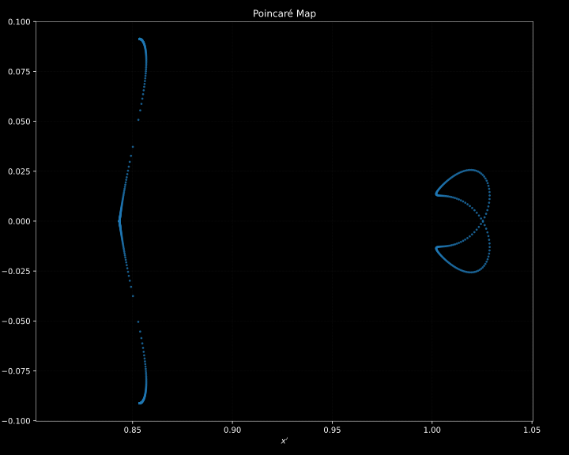
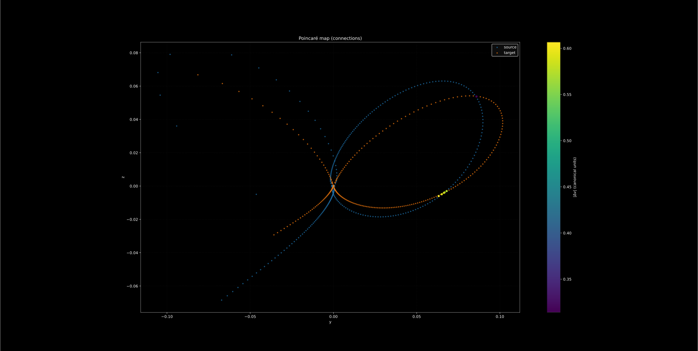

# HITEN - Computational Toolkit for the Circular Restricted Three-Body Problem

[](https://pypi.org/project/hiten/)
[](https://iamgadmarconi.github.io/hiten/)

## Overview

**HITEN** is a research-oriented Python library that provides an extensible implementation of high-order analytical and numerical techniques for the circular restricted three-body problem (CR3BP).

## Installation

HITEN is published on PyPI. A recent Python version (3.9+) is required.

```bash
py -m pip install hiten
```

## Quickstart

Full documentation is available [here](https://iamgadmarconi.github.io/hiten/).

Compute a halo orbit around Earth-Moon L1 and plot a branch of its stable manifold:

```python
from hiten import System

system = System.from_bodies("earth", "moon")
l1 = system.get_libration_point(1)

orbit = l1.create_orbit("halo", amplitude_z=0.2, zenith="southern")
orbit.correct(max_attempts=25)
orbit.propagate(steps=1000)

manifold = orbit.manifold(stable=True, direction="positive")
manifold.compute()
manifold.plot()
```

## Examples

1. **Parameterisation of periodic orbits and their invariant manifolds**

   The toolkit constructs periodic solutions such as halo orbits and computes their stable and unstable manifolds.

   ```python
   from hiten import System

   system = System.from_bodies("earth", "moon")
   l1 = system.get_libration_point(1)

   orbit = l1.create_orbit("halo", amplitude_z=0.2, zenith="southern")
   orbit.correct(max_attempts=25)
   orbit.propagate(steps=1000)

   manifold = orbit.manifold(stable=True, direction="positive")
   manifold.compute()
   manifold.plot()
   ```

   

   *Figure&nbsp;1 - Stable manifold of an Earth-Moon \(L_1\) halo orbit.*

   Knowing the dynamics of the center manifold, initial conditions for vertical orbits can be computed and associated manifolds created. These reveal natural transport channels that can be exploited for low-energy mission design.

   ```python
   from hiten import System, VerticalOrbit

   system = System.from_bodies("earth", "moon")
   l1 = system.get_libration_point(1)

   cm = l1.get_center_manifold(degree=10)
   cm.compute()

   initial_state = cm.to_synodic(poincare_point=[0.0, 0.0], energy=0.6, section_coord="q3")

   orbit = VerticalOrbit(l1, initial_state=initial_state)
   orbit.correct(max_attempts=100)
   orbit.propagate(steps=1000)

   manifold = orbit.manifold(stable=True, direction="positive")
   manifold.compute()
   manifold.plot()
   ```

   

   *Figure&nbsp;2 - Stable manifold of an Earth-Moon \(L_1\) vertical orbit.*

2. **Generating families of periodic orbits**

   The toolkit can generate families of periodic orbits by continuation.

   ```python
   from hiten import System, OrbitFamily
   from hiten.algorithms import ContinuationPipeline
   from hiten.algorithms.types.states import SynodicState

   system = System.from_bodies("earth", "moon")
   l1 = system.get_libration_point(1)

   seed = l1.create_orbit('lyapunov', amplitude_x=1e-3)
   seed.correct(max_attempts=25)

   target_amp = 1e-2  # grow A_x from 0.001 to 0.01 (relative amplitude)
   current_amp = seed.amplitude
   num_orbits = 10

   # Step in amplitude space (predictor still tweaks X component)
   step = (target_amp - current_amp) / (num_orbits - 1)

   engine = ContinuationPipeline(
       initial_orbit=seed,
       state=SynodicState.X,   # underlying coordinate that gets nudged
       amplitude=True,         # but the continuation parameter is A_x
       target=(current_amp, target_amp),
       step=step,
       corrector_kwargs=dict(max_attempts=50, tol=1e-13),
       max_orbits=num_orbits,
   )
   engine.run()

   family = OrbitFamily.from_engine(engine)
   family.propagate()
   family.plot()
   ```

    

    *Figure&nbsp;3 - Family of Earth-Moon \(L_1\) Lyapunov orbits.*

3. **Generating Poincare maps**

   The toolkit can generate Poincare maps for arbitrary sections. For example, the centre manifold of the Earth-Moon \(L_1\) libration point:

   ```python
   from hiten import System

   system = System.from_bodies("earth", "moon")
   l1 = system.get_libration_point(1)

   cm = l1.get_center_manifold(degree=12)
   cm.compute()

   pm = cm.poincare_map(energy=0.7, section_coord="q2", n_seeds=50, n_iter=100, seed_strategy="axis_aligned")
   pm.compute()
   pm.plot()
   ```

   

   *Figure&nbsp;4 - Poincare map of the centre manifold of the Earth-Moon \(L_1\) libration point using the \(q_2=0\) section.*

   Or the synodic section of a vertical orbit manifold:

   ```python
   from hiten import System, VerticalOrbit
   from hiten.algorithms import SynodicMap, SynodicMapConfig

   system = System.from_bodies("earth", "moon")
   l_point = system.get_libration_point(1)

   cm = l_point.get_center_manifold(degree=6)
   cm.compute()

   ic_seed = cm.to_synodic([0.0, 0.0], 0.6, "q3") # Good initial guess from CM

   orbit = VerticalOrbit(l_point, initial_state=ic_seed)
   orbit.correct(max_attempts=100, finite_difference=True)
   orbit.propagate(steps=1000)

   manifold = orbit.manifold(stable=True, direction="positive")
   manifold.compute(step=0.005)
   manifold.plot()

   section_cfg = SynodicMapConfig(
      section_axis="y",
      section_offset=0.0,
      plane_coords=("x", "z"),
      interp_kind="cubic",
      segment_refine=30,
      newton_max_iter=10,
   )
   synodic_map = SynodicMap(section_cfg)
   synodic_map.from_manifold(manifold)
   synodic_map.plot()
   ```

   

   *Figure&nbsp;5 - Synodic map of the stable manifold of an Earth-Moon \(L_1\) vertical orbit.*

4. **Detecting heteroclinic connections**

   The toolkit can detect heteroclinic connections between two manifolds.

   ```python
   from hiten.algorithms.connections import ConnectionPipeline, SearchConfig
   from hiten.algorithms.poincare import SynodicMapConfig
   from hiten.system import System

   system = System.from_bodies("earth", "moon")
   mu = system.mu

   l1 = system.get_libration_point(1)
   l2 = system.get_libration_point(2)

   halo_l1 = l1.create_orbit('halo', amplitude_z=0.5, zenith='southern')
   halo_l1.correct()
   halo_l1.propagate()

   halo_l2 = l2.create_orbit('halo', amplitude_z=0.3663368, zenith='northern')
   halo_l2.correct()
   halo_l2.propagate()

   manifold_l1 = halo_l1.manifold(stable=True, direction='positive')
   manifold_l1.compute(integration_fraction=0.9, step=0.005)

   manifold_l2 = halo_l2.manifold(stable=False, direction='negative')
   manifold_l2.compute(integration_fraction=1.0, step=0.005)

   section_cfg = SynodicMapConfig(
      section_axis="x",
      section_offset=1 - mu,
      plane_coords=("y", "z"),
      interp_kind="cubic",
      segment_refine=30,
      tol_on_surface=1e-9,
      dedup_time_tol=1e-9,
      dedup_point_tol=1e-9,
      max_hits_per_traj=None,
      n_workers=None,
   )

   conn = ConnectionPipeline.with_default_engine(
      section=section_cfg,
      direction=None,
      search_cfg=SearchConfig(delta_v_tol=1, ballistic_tol=1e-8, eps2d=1e-3),
   )

   conn.solve(manifold_l1, manifold_l2)
   print(conn)
   conn.plot(dark_mode=True)
   ```

   

   *Figure&nbsp;6 - Heteroclinic connection between the stable manifold of an Earth-Moon \(L_1\) halo orbit and the unstable manifold of an Earth-Moon \(L_2\) halo orbit.*

5. **Generating invariant tori**

   Hiten can generate invariant tori for periodic orbits.

   ```python
   from hiten import System
   from hiten import InvariantTori

    system = System.from_bodies("earth", "moon")
    l1 = system.get_libration_point(1)

    orbit = l1.create_orbit('halo', amplitude_z=0.3, zenith='southern')
    orbit.correct(max_attempts=25)
    orbit.propagate(steps=1000)
   
    torus = InvariantTori(orbit)
    torus.compute(epsilon=1e-2, n_theta1=256, n_theta2=256)
    torus.plot()
   ```

   

   *Figure&nbsp;7 - Invariant torus of an Earth-Moon \(L_1\) quasi-halo orbit.*

## Run the examples

Example scripts are in the `examples` directory. From the project root:

```powershell
py -m pip install -e .
python examples\periodic_orbits.py
python examples\orbit_family.py
python examples\synodic_map.py
python examples\heteroclinic_connection.py
```

## Contributing

Issues and pull requests are welcome. For local development:

```powershell
py -m pip install -e .[dev]
python -m pytest -q
```

## License

This project is licensed under the terms of the MIT License. See `LICENSE`.
