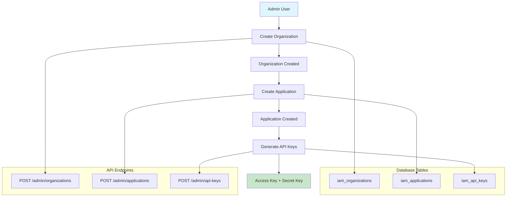
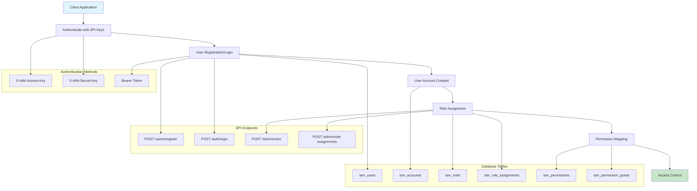
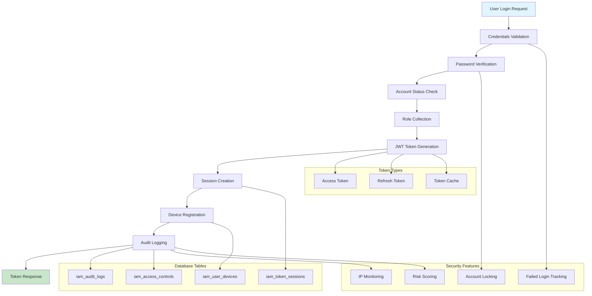
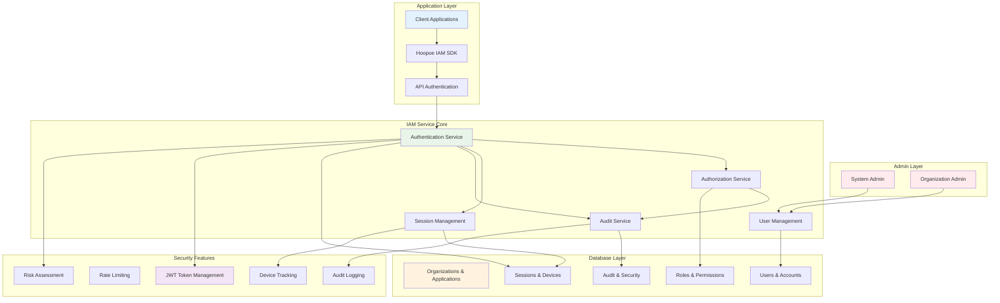
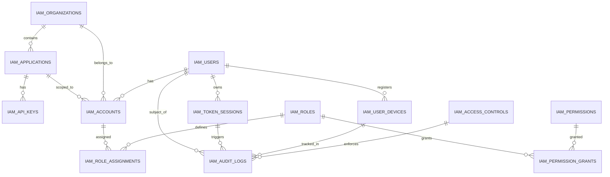

# Hoopoe IAM Service - Comprehensive Flow Diagrams

This document provides comprehensive flow diagrams for the Hoopoe IAM Service, illustrating the relationships and data flows between different components.

## Overview

The Hoopoe IAM Service provides Identity and Access Management capabilities with the following key flows:
1. **Administrative Setup Flow**: Admin → Organization → Application → API Keys
2. **User Authentication & Authorization Flow**: Client/App → User → Roles → Permissions
3. **Login & Session Management Flow**: User → Login → Devices → Tokens

---

## 1. Administrative Setup Flow

### Administrative Setup Process:

1. **Admin Authentication**: Admin uses bearer token authentication with `IAM_ADMIN_API_KEY`
2. **Organization Creation**: Admin creates organization through `/admin/organizations` endpoint
3. **Application Registration**: Admin creates application under organization via `/admin/applications`
4. **API Key Generation**: Admin generates access/secret key pairs for application authentication

### Key Database Tables:
- **iam_organizations**: Stores organization metadata and settings
- **iam_applications**: Stores application configurations linked to organizations
- **iam_api_keys**: Stores AWS-style access/secret key pairs for application authentication

---

## 2. User Authentication & Authorization Flow

### User Authentication Process:

1. **Application Authentication**: Client app authenticates using API access/secret keys
2. **User Operations**: App can register users or facilitate user login
3. **Account Creation**: Each user gets an account per application/organization
4. **Role Assignment**: Users are assigned roles (e.g., premium-user, moderator, admin)
5. **Permission Mapping**: Roles are mapped to specific permissions
6. **Access Control**: System enforces permissions for resource access

### Key Database Tables:
- **iam_users**: Global user records with credentials
- **iam_accounts**: User accounts scoped to specific app/organization combinations
- **iam_roles**: Role definitions with scope and level
- **iam_role_assignments**: Links users to roles within organizations
- **iam_permissions**: Permission definitions for various resources
- **iam_permission_grants**: Grants specific permissions to users or roles

---

## 3. Login & Session Management Flow

### Login Session Process:

1. **Authentication**: User provides identifier (email/username) and password
2. **Validation**: System verifies credentials and checks account status
3. **Security Checks**: Failed login tracking, account locking, risk assessment
4. **Role Resolution**: Collect user roles for the specific application/organization
5. **Token Generation**: Create JWT access and refresh tokens with role claims
6. **Session Tracking**: Store session information with JTI tracking
7. **Device Registration**: Track device information for security monitoring
8. **Audit Logging**: Log all authentication events with risk scores
9. **Response**: Return tokens and user/account information

### Key Database Tables:
- **iam_token_sessions**: JWT session tracking with access/refresh JTIs
- **iam_user_devices**: Device fingerprinting and tracking
- **iam_audit_logs**: Comprehensive authentication and authorization audit trail
- **iam_access_controls**: Real-time access control rules and violations

---

## 4. Complete System Architecture

---

## 5. Data Flow Summary

### Administrative Flow:
1. **Admin** → Creates **Organization** → Creates **Application** → Generates **API Keys**
2. Database: `iam_organizations` → `iam_applications` → `iam_api_keys`

### Application Authentication Flow:
1. **Client App** → Authenticates with **API Keys** → Accesses **IAM Endpoints**
2. Headers: `X-IAM-Access-Key` + `X-IAM-Secret-Key` or `Authorization: Bearer {token}`

### User Lifecycle Flow:
1. **User Registration** → **Account Creation** → **Role Assignment** → **Permission Mapping**
2. Database: `iam_users` → `iam_accounts` → `iam_role_assignments` → `iam_permission_grants`

### Login Session Flow:
1. **Login Request** → **Authentication** → **Token Generation** → **Session Creation** → **Device Tracking**
2. Database: `iam_token_sessions` + `iam_user_devices` + `iam_audit_logs`

### Security & Audit Flow:
1. **All Operations** → **Risk Assessment** → **Audit Logging** → **Access Control** → **Monitoring**
2. Database: `iam_audit_logs` + `iam_access_controls` + security metrics

---

## 6. Database Table Relationships

---

## Implementation Notes

### Security Considerations:
- All passwords are hashed using bcrypt
- JWT tokens include expiration and role-based claims
- Failed login attempts trigger account locking
- All operations are audit logged with risk scoring
- Device fingerprinting helps detect suspicious activities

### Scalability Features:
- Token caching for improved performance
- Async database operations using SQLAlchemy
- Connection pooling for database efficiency
- Modular service architecture for horizontal scaling

### Integration Points:
- RESTful API endpoints for all operations
- Python SDK for easy integration
- Standardized error responses
- Comprehensive audit trail for compliance

This comprehensive flow documentation should help understand the complete IAM system architecture and data flows within the Hoopoe IAM Service.
