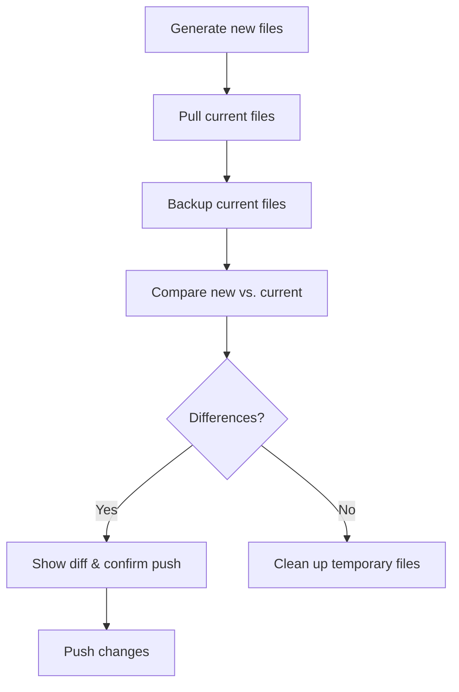

# Infrable

Infrable is an Infrastructure as Code tool written in Python. It lets you manage hosts,
services, configuration templates, deployments, and more—all from a single Python file
(named `infra.py`).

[](https://pypi.org/project/infrable)

---

## Prerequisites

- **Python 3.12 or newer**
- Basic command-line knowledge

---

## 1. Installation and Project Setup

**Install Infrable:**

```bash
pip install -U infrable
```

**Bootstrap a New Project:**

```bash
infrable init
```

This command creates the basic project structure you’ll need.

---

## 2. Defining Hosts and Services

In Infrable, you describe your infrastructure in a single file (named `infra.py`). Here
you define all your hosts and the services running on them.

**Example `infra.py`:**

```python
from infrable import Host, Service

# Define your hosts
dev_host = Host(fqdn="dev.example.com", ip="127.0.0.1")
beta_host = Host(fqdn="beta.example.com", ip="127.0.0.1")
prod_host = Host(fqdn="prod.example.com", ip="127.0.0.1")

# Define services on the hosts
dev_web = Service(host=dev_host, port=8080)
beta_web = Service(host=beta_host, port=8080)
prod_web = Service(host=prod_host, port=8080)

dev_nginx = Service(host=dev_host, port=80)
beta_nginx = Service(host=beta_host, port=80)
prod_nginx = Service(host=prod_host, port=80)
```

**View your hosts and services:**

```bash
infrable hosts
infrable services
```

---

## 3. Working with Templates

Templates let you manage configuration files dynamically. You write these using Jinja2
syntax and include metadata (like file paths and permissions) as header comments.

**Add a template prefix in `infra.py`:**

```python
template_prefix = "https://github.com/username/repository/blob/main"
```

**Example: Nginx configuration template (`templates/nginx/web.j2`):**

```nginx
# ---
# src: {{ template_prefix }}/{{ _template.src }}
# dest:
#   - {{ dev_nginx.host }}:/etc/nginx/sites-enabled/web
#   - {{ beta_nginx.host }}:/etc/nginx/sites-enabled/web
#   - {{ prod_nginx.host }}:/etc/nginx/sites-enabled/web
# chmod: 644
# chown: root:root
# ---

server {
    listen {{ dev_nginx.port }};
    listen [::]:{{ dev_nginx.port }};

    server_name {{ dev_nginx.host.fqdn }} www.{{ dev_nginx.host.fqdn }};

    location / {
        proxy_pass http://127.0.0.1:{{ dev_web.port }};
        include proxy_params;
    }

    location /robots.txt {
        root /var/www/html;
    }
}
```

> **Notes:**
>
> - The `template_prefix` and `*_nginx` variables are defined in `infra.py`.
> - The `_template.src` variable is automatically available in all templates.
> - The `dest` metadata field specifies the target path on the host.
> - The `chmod` and `chown` metadata fields set file permissions and ownership.
> - There are other metadata fields you can use, like `execute` and `skip`.
> - You can also declare multiple destinations with different chmod, chown values
>   and context variables using yaml list syntax.

**Example: A template script with destination as list (`templates/nginx/robots.txt.sh.j2`):**

```bash
#!/usr/bin/env bash

# ---
# src: {{ template_prefix }}/{{ _template.src }}
# dest:
#   - loc: {{ dev_nginx.host }}:/root/init/robots.txt.sh
#     ctx:
#       disallow: "/"
#   - loc: {{ beta_nginx.host }}:/root/init/robots.txt.sh
#     ctx:
#       disallow: "/"
#   - loc: {{ prod_nginx.host }}:/root/init/robots.txt.sh
#     ctx:
#       disallow: ""
# execute: true
# ---

set -euxo pipefail

if [ ! -d /var/www/html ]; then
    mkdir -p /var/www/html
fi

cat > /var/www/html/robots.txt <<EOF
User-agent: *
Disallow: {{ disallow }}
EOF
```

> **Notes:**
>
> - The `execute: true` metadata flag tells Infrable to execute the script on the remote
>   host.
> - The value of `disallow` is set based on the context variables declared in the
>   template header.

---

## 4. Deploying and Recovering Files

Before pushing configuration changes, Infrable compares your new files with those
currently deployed. This helps you catch unintended changes. It also keeps a backup of
the current configuration, so you can roll back if needed.

### Deploy Workflow

**Deploy your files:**

```bash
infrable files deploy [path]

## Same as
# infrable files gen [path]
# infrable files pull
# infrable files backup
# infrable files push
```

This command performs several steps:

- Generates new files from your templates.
- Pulls the current files from the server.
- Backs up the current configuration.
- Compares the new and old versions.
- Prompts you to push changes if differences are found.

You can run the same workflow in Python:

```python
import infrable.files

infrable.files.deploy(path)

## Same as
# infrable.files.gen(path)
# infrable.files.pull()
# infrable.files.backup()
# infrable.files.push()
```

A simplified flowchart of the process:



### Recover Workflow

If you need to roll back changes, use the recover workflow:

```bash
infrable files recover [path]

## Same as
# infrable files revert [path]
# infrable files push
```

Or in Python:

```python
import infrable.files

infrable.files.recover(path)

## Same as
# infrable.files.revert(path)
# infrable.files.push()
```

---

## 5. Running Remote Commands, Tasks, and Workflows

Infrable allows you to execute commands remotely on your defined hosts.

### Running Remote Commands

Run a command on a specific host:

```bash
infrable remote dev_host "sudo systemctl reload nginx"
```

Run on a service:

```bash
infrable remote dev_nginx "sudo systemctl reload nginx"
```

Run on all hosts affected by a file change:

```bash
infrable remote affected-hosts "sudo systemctl reload nginx"
```

Or combine with file diff:

```bash
infrable files affected-hosts | infrable remote - "sudo systemctl reload nginx"
```

### Creating Tasks

Tasks are groups of commands that simplify repeated actions. Define them in `infra.py`.

**Example Task:**

```python
import typer

# Add a task group for the dev_nginx service
dev_nginx.typer = typer.Typer(help="Tasks for dev_nginx.")

@dev_nginx.typer.command(name="reload")
def reload_dev_nginx():
    """Test configuration and reload the Nginx service."""

    assert dev_nginx.host, "Service must have a host to reload"

    # Run: sudo nginx -t
    dev_nginx.host.remote().sudo.nginx("-t")

    # Run: sudo systemctl reload nginx
    dev_nginx.host.remote().sudo.systemctl.reload.nginx()
```

Run the task:

```bash
infrable dev-nginx reload
```

### Creating Workflows

Workflows let you combine tasks into a complete deployment process.

**Example Workflow:**

```python
from infrable import files, concurrentcontext, paths, retryable

deploy = typer.Typer(help="Deployment workflows.")

@deploy.command(name="dev-nginx")
def deploy_dev_nginx():
    """Deploy dev_nginx configuration."""

    # Deploy the Nginx configuration files
    files.deploy(paths.templates / "nginx")

    # Test the Nginx configuration and reload the service concurrently
    cmd = "sudo nginx -t && sudo systemctl reload nginx && echo success || echo failed"
    fn = lambda host: (host, host.remote().sudo(cmd))
    with concurrentcontext(retryable(fn), files.affected_hosts()) as results:
        for host, result in results:
            print(f"{host}: {result}")
```

Run the workflow:

```bash
infrable deploy dev-nginx
```

---

## 6. Using Environments and Switches

Environments (like dev, beta, prod) let you use the same templates and tasks for different deployment targets.

**Define environments and a switch in `infra.py`:**

```python
from infrable import Switch, Host, Service

# Define environment names
dev = "dev"
beta = "beta"
prod = "prod"
environments = {dev, beta, prod}

# Create a switch for environments (default is dev)
env = Switch(environments, init=dev)
current_env = env()

# Define hosts for each environment
dev_host = Host(fqdn="dev.example.com", ip="127.0.0.1")
beta_host = Host(fqdn="beta.example.com", ip="127.0.0.2")
prod_host = Host(fqdn="prod.example.com", ip="127.0.0.3")

# Use the switch to select hosts based on environment
managed_hosts = env(
    dev=[dev_host],
    beta=[beta_host],
    prod=[prod_host]
)

# Define a service using a strict switch to choose the host
web = Service(
    host=env.strict(dev=dev_host, beta=beta_host, prod=prod_host),
    port=8080
)
```

**Update Templates to Use Environment-Specific Values:**

For example, in `templates/nginx/proxy_params.j2`:

```nginx
# ---
# src: {{ template_prefix }}/{{ _template.src }}
# dest:
# 
#   - {{ host }}:/etc/nginx/proxy_params
# 
# chmod: 644
# chown: root:root
# ---
proxy_set_header Host $http_host;
proxy_set_header X-Real-IP $remote_addr;
proxy_set_header X-Forwarded-For $proxy_add_x_forwarded_for;
proxy_set_header X-Forwarded-Proto $scheme;
```

> **Note:** Yes, you can use loops in template headers!

**Managing the Environment Switch:**

```bash
# Switch to a specific environment
infrable switch env [dev|beta|prod]

# Check the current environment
infrable switch env

# List available environments
infrable switch env --options

# Shortcut alias (if switch is named "env")
infrable env [dev|beta|prod]

# List all switches
infrable switches
```

---

## 7. Managing Meta and Secrets

Keep sensitive information (like secret keys) out of your version control by storing them in separate files.

**Example in `infra.py`:**

```python
from infrable import Meta, readfile

# Read a secret key from a file
common_secret_key = readfile("secrets/common/secret_key")

# Attach secret metadata to a service
web = Service(
    meta=Meta(secret_key=common_secret_key),
    host=env(dev=dev_host, beta=beta_host, prod=prod_host),
    port=8080
)
```

**Tip:** Add your secrets folder to `.gitignore`:

```bash
echo /secrets/ >> .gitignore
```

---

## 8. Extending Infrable with Custom Modules

You can add custom Python modules to extend Infrable’s functionality.

**Example module (`modules/mycloud.py`):**

```python
from dataclasses import dataclass
from typer import Typer
from infrable import Host, infra

@dataclass
class MyCloud:
    """Custom module for MyCloud operations."""

    secret_api_key: str
    typer: Typer | None = None

    def provision_ubuntu_host(self, fqdn: str):
        ip = self.api.create_ubuntu_host(fqdn)
        return MyCloudUbuntuHost(fqdn=fqdn, ip=ip)

@dataclass
class MyCloudUbuntuHost(Host):
    """Customized Ubuntu host for MyCloud."""

    def setup(self):
        self.install_mycloud_agent()

    def install_mycloud_agent(self):
        raise NotImplementedError

workflows = Typer()

@workflows.command()
def provision_ubuntu_host(fqdn: str, setup: bool = True):
    """Provision an Ubuntu host."""

    # Get the MyCloud instance from infra.py
    cloud = next(iter(infra.item_types[MyCloud].values()))
    host = cloud.provision_ubuntu_host(fqdn)
    if setup:
        host.setup()
    name = fqdn.split(".")[0].replace("-", "_")

    print("Add the host to the infra.py file.")
    print(f"{name} = {repr(host)}")
```

**Plug the module into your `infra.py`:**

```python
from modules import mycloud

# Integrate the custom module with Infrable
cloud = mycloud.MyCloud(secret_api_key=readfile("secrets/mycloud/secret_api_key"))
cloud.typer = mycloud.workflows
```

**Run the module workflow:**

```bash
infrable cloud --help
```

---

## Conclusion

You’ve now learned how to:

- Install and initialize an Infrable project
- Define hosts and services in a single file
- Use templates to manage configuration files
- Deploy changes safely and recover configurations when needed
- Run remote commands, tasks, and workflows
- Manage environments for different deployment targets
- Handle secrets securely
- Extend Infrable with custom Python modules

With these building blocks, even new developers can start managing infrastructure as code using Infrable. Happy coding!
