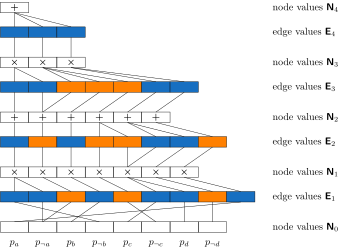

KLay Docs
==================

**KLay is a Python library for accelerating inference on sparse arithmetic circuits.**

Get started using the :ref:`quickstart`!

At its core, KLay transforms sparse directed acyclic graphs into layers that can be executed in parallel.
The design of KLay is described in our paper `KLay: Accelerating Arithmetic Circuits for Neurosymbolic AI <https://arxiv.org/pdf/2410.11415>`_, published at ICLR 2025.

----

Contents
********

.. toctree::

   Home <self>
   quickstart
   circuit_creation
   circuit_eval
   api

