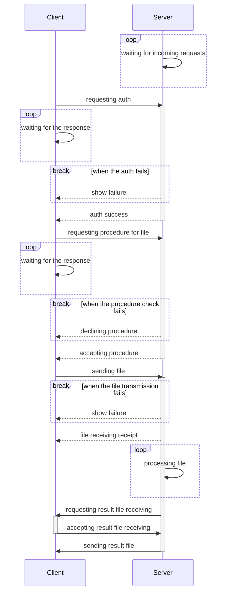

# kontor

[](https://github.com/psf/black)
[](https://pypi.org/project/kontor)
[](https://pypi.python.org/pypi/kontor/)
[](https://github.com/morwy/kontor/actions/workflows/python-tests.yml)

kontor is a client-server bundle that is designed to execute pre-defined procedures on server by request of authorized client.

Currently kontor is in pre-alpha stage, providing no secure way of transferring the files.

## Installation

**kontor** can be installed or upgraded by simply calling **pip** command:

```bash
pip install kontor --upgrade
```

## Requirements & dependencies

Minimum Python version supported is 3.7.

kontor relies on one external package called **dacite**.

## Configuration

### Enabling SSL connection

#### Linux (Ubuntu)

0. Install **ca-certificates** application, if needed:

```bash
sudo apt-get install -y ca-certificates
```

1. Generate a Certificate Authority (CA):

```bash
openssl genrsa -out kontor.key 2048
```

2. Self-sign the newly created Certificate Authority (CA):

```bash
openssl req -x509 -new -nodes -key kontor.key -sha256 -days 365 -out kontor.crt
```

3. Copy newly generated certificate to local certificate folder:

```bash
sudo cp kontor.crt /usr/local/share/ca-certificates
```

4. Update current list of used certificates:

```bash
sudo update-ca-certificates
```

5. Add `kontor.crt` and `kontor.key` to server configuration with `forced_ssl_usage` set to `true`:

```json
    ...
    "forced_ssl_usage": true,
    "certificate_path" : "kontor.crt",
    "certificate_key_path" : "kontor.key",
    ...
```

## Examples

### Bureau

#### Windows

It is possible to run Bureau as service on Windows by using [WinSW v3](https://github.com/winsw/winsw/tree/v3) as bundled tool.

1. Create a new folder, e.g. `C:\kontor`
2. Download WinSW executable of suitable version
3. Put it to `C:\kontor` folder
4. Rename it to `kontor.exe`
5. Create a `kontor.xml` configuration file and add following text there:

```xml
<service>
  <id>kontor</id>
  <name>kontor</name>
  <description>This service runs kontor as Windows service.</description>
  <executable>python</executable>
  <arguments>start_server.py</arguments>
  <log mode="none" />
  <onfailure action="restart" />
</service>
```

6. Create a `start_server.py` file and add following text there (this file is also present in `examples/server` repo folder):

```python
#!/usr/bin/env python
import logging
import os
import signal
import sys

from kontor.bureau import Bureau


def shutdown_signal_handler(sig, frame):
    logging.critical("Caught SIGINT signal, bureau will be shut down.")
    sys.exit(0)


if __name__ == "__main__":
    #
    # Catch Ctrl+C signal for notifying about bureau shutdown.
    #
    signal.signal(signal.SIGINT, shutdown_signal_handler)

    bureau = Bureau(os.path.dirname(os.path.realpath(__file__)))
    bureau.start()
```

7. Install kontor as a service by calling following command in CMD:

```batch
kontor install
```

8. Create `server_configuration.json` file next to `start_server.py`. Example configuration may look like following:

```json
{
    "ip_address": "localhost",
    "port": 5690,
    "chunk_size_kilobytes": 256,
    "client_idle_timeout_seconds": 30,
    "max_storage_period_hours": 0,
    "max_parallel_connections": 100,
    "max_consequent_client_procedures": 1,
    "max_grace_shutdown_timeout_seconds": 30,
    "forced_ssl_usage": false,
    "certificate_path" : "~/test_certificate.cer",
    "certificate_key_path" : "~/test_certificate.key",
    "procedures": {
        "test_procedure": {
            "name": "test_procedure",
            "operation": "echo \"this is a test procedure\"",
            "error_codes": [
                1
            ],
            "max_repeats_if_failed": 3,
            "time_seconds_between_repeats": 10
        }
    }
}
```

9. Start service by calling the command:

```batch
kontor start
```

10. [WinSW CLI instruction](https://github.com/winsw/winsw/blob/v3/docs/cli-commands.md) has a lot more of useful commands that can be applied. Most useful though would be following:

```batch
kontor stop
```

```batch
kontor restart
```

```batch
kontor uninstall
```

## Bureau-applicant interaction flowchart

<details>

<summary>Click to show the flowchart (it is pretty long)</summary>



</details>
