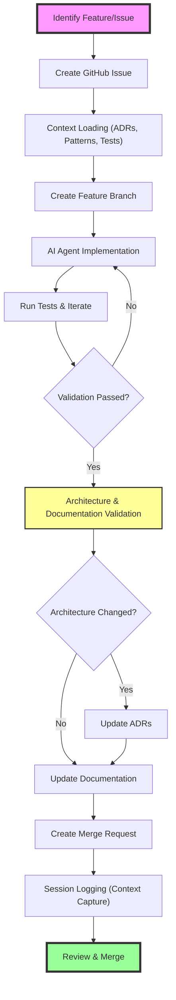

# Contributing to AIPR

This project uses an AI-agent driven development workflow, combining automated coding with human oversight to ensure consistent, high-quality implementations.

> This AI-agent driven workflow ensures quality through structure, testing, architecture evaluation, and human oversight.

## Core Principle

Architecture comes first. Our [Architecture Decision Records (ADRs)](docs/adr/index.md) define behavior, capture decisions, and guide implementation. The defined workflow ensures that if each step is followed — from context loading to validation and documentation — code quality and test coverage become natural outcomes, not afterthoughts.

By adhering to this process, AI agents avoid introducing technical debt and stay aligned with the bigger picture of the project. This disciplined approach ensures sustainable, high-quality contributions without sacrificing long-term maintainability.

## Before You Start

- Review relevant [ADRs](docs/adr/index.md) to understand architectural decisions
- If you're planning a large or complex change, open an issue first to discuss the approach
- Have questions? Open a Discussion or create an Issue with the "question" label
- All contributions must follow our [Code of Conduct](CODE_OF_CONDUCT.md)

## Development Guide

1. **Prerequisites**
   - Python 12 or higher
   - Git
   - GitHub account
   - GitHub CLI (`gh`) - https://cli.github.com

2. **Package and Command Names**
   - PyPI Package Name: `pr-generator-agent` (for installation)
   - Module Name: `aipr` (for imports)
   - Command Name: `aipr` (CLI tool)

   Example usage:
   ```bash
   # Installing the package
   pip install pr-generator-agent

   # Using the CLI tool
   aipr

   # Importing in Python
   from aipr import ...
   ```

3. **Development Commands**
```bash
# Key make targets
make install  # Sets up the virtualenv and installs dependencies
make check    # Runs linting, formatting, tests
make test     # Just run the test suite
make pr       # Creates a pull request via gh/glab
make clean    # Removes build artifacts & venv
```

4. **Code Style**
- We use Black for code formatting and Flake8 for linting
- All code must pass `make check` before being merged
- GitHub Actions will automatically verify these checks on your PR

5. **Commit Conventions**
We use [Conventional Commits](https://www.conventionalcommits.org/) to automate versioning and changelog generation. Your commit messages should follow this format:
```
type(optional-scope): description

[optional body]
[optional footer(s)]
```

Types that affect versioning:
- `feat:` - New feature (bumps minor version)
- `fix:` - Bug fix (bumps patch version)
- `feat!:` or `fix!:` - Breaking change (bumps major version)

Other types (don't affect version):
- `docs:` - Documentation changes
- `style:` - Code style changes
- `refactor:` - Code changes that neither fix a bug nor add a feature
- `test:` - Adding/updating tests
- `chore:` - Maintenance tasks

Examples:
```bash
git commit -m "feat: add support for OpenAI models"
git commit -m "fix: handle empty commit messages"
git commit -m "feat!: switch to new API version"
git commit -m "docs: update installation instructions"
```

6. **Initial Setup**
```bash
# Verify GitHub CLI is installed and authenticated
gh auth status

# Fork the repository and clone it
gh repo fork danielscholl/pr-generator-agent --clone=true
cd pr-generator-agent

# The gh fork command automatically sets up the upstream remote
# You can verify with: git remote -v

# Create virtual environment and install dependencies
make install

# Activate the virtual environment
source .venv/bin/activate
```

7. **AI-Driven Development Workflow**

For AI agents and human contributors following the AI-driven approach:

```bash
# Ensure your fork is up to date
git fetch upstream
git checkout main
git merge upstream/main

# Create a new branch
git checkout -b agent/<issue-number>-<short-description>

# CONTEXT LOADING PHASE
# 1. Review relevant ADRs: docs/adr/index.md
# 2. Analyze existing code patterns in aipr/
# 3. Study test patterns in tests/
# 4. Check CLAUDE.md for project guidelines

# IMPLEMENTATION & VALIDATION LOOP
# 1. Implement following TDD approach
# 2. Run tests iteratively: make test
# 3. Ensure 80%+ coverage
# 4. Validate against architectural patterns

# ARCHITECTURE VALIDATION
# 1. Check if implementation affects existing ADRs
# 2. Create new ADRs if architectural decisions made
# 3. Update documentation if patterns evolved

# FINAL VERIFICATION
make check  # Must pass all checks

# Commit and push your changes
git add .
git commit -m "feat: description of your changes"  # Use conventional commits!
git push -u origin feature-name

# Create a pull request
make pr                         # Uses commit messages for title and description
make pr title="Add new feature" # Uses a specific title
```

## Release Process

Releases are automated using Release Please. Here's how it works:

1. **Versioning**
   - Commits to `main` automatically trigger version updates based on conventional commits
   - `fix:` commits bump the patch version (0.1.0 → 0.1.1)
   - `feat:` commits bump the minor version (0.1.0 → 0.2.0)
   - `feat!:` or any commit with `!` bump the major version (0.1.0 → 1.0.0)

2. **Release Flow**
   - Push commits to main using conventional commit messages
   - Release Please automatically creates/updates a release PR
   - When the release PR is merged:
     - Version is bumped in `pyproject.toml` and `__init__.py`
     - Changelog is updated
     - GitHub release is created
     - Git tag is created

3. **Publishing**
   - Publishing to PyPI is a manual step
   - Go to Actions → Release Management
   - Click "Run workflow"
   - Select "Publish current release to PyPI"
   - Click "Run workflow"

## AI Agent Guidelines

This project is optimized for AI coding agents. When working with AI agents:

### Issue Creation & Assignment
```bash
# Create well-scoped issues with clear acceptance criteria
gh issue create -t "feat: Add new provider support" -l enhancement

# Reference architectural patterns and ADRs
# Specify which files need modification
# Define success criteria clearly
```

### Best Tasks for AI Agents
- Adding new providers following existing patterns (ADR-001)
- Implementing prompt templates (ADR-002)
- Enhancing Git integration features (ADR-003)
- Adding security scanning capabilities (ADR-004)
- Improving test coverage
- Fixing type errors or lint issues
- Small, well-defined features

### Avoid Assigning AI Agents
- Major architectural changes without ADR updates
- Security-critical modifications
- Complex cross-module refactoring
- Ambiguous or exploratory tasks

### Session Logging for AI Memory

AI agents should maintain session logs for complex workflows:

```markdown
# Session Log - [Date] - [Feature/Epic]

## Context Loaded
- ADRs reviewed: 001, 002, 003
- Code patterns analyzed: aipr/providers.py, aipr/prompts/
- Tests studied: tests/test_providers.py

## Implementation Summary
- New provider added following ADR-001 pattern
- Error handling aligned with existing patterns
- Tests achieve 85% coverage

## Architectural Impact
- No ADR changes required
- Pattern consistency maintained
- Future provider additions can follow same approach

## Lessons Learned
- Provider-specific parameter handling needs documentation
- Test mocking patterns work well for external APIs
```

## Development Workflow Overview



## Pull Request Process

1. **Automated Checks**: All PRs must pass `make check`
2. **Architecture Review**: Large changes need ADR validation
3. **AI Agent PRs**: Include session context in PR description
4. **Human Review**: Maintainer reviews within 3 business days
5. **Merge**: Once approved and checks pass, we'll merge your contribution

## License

By contributing, you agree that your contributions will be licensed under the MIT License.
