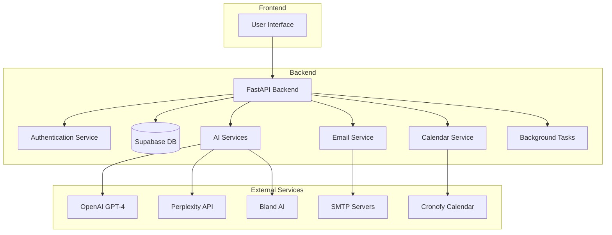
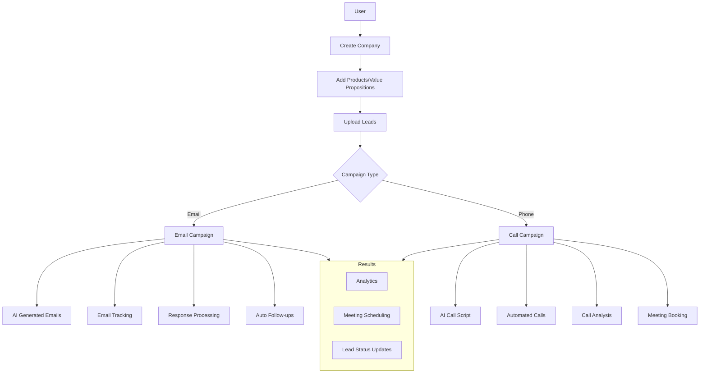
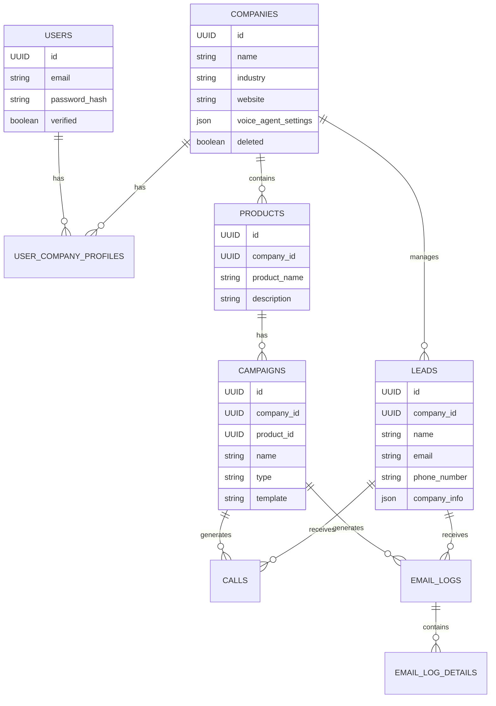
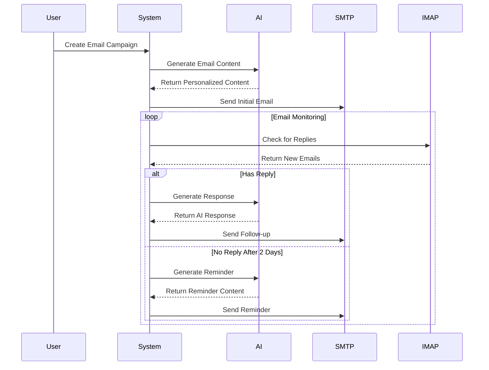
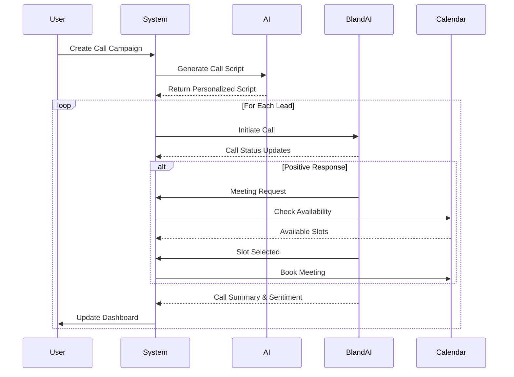
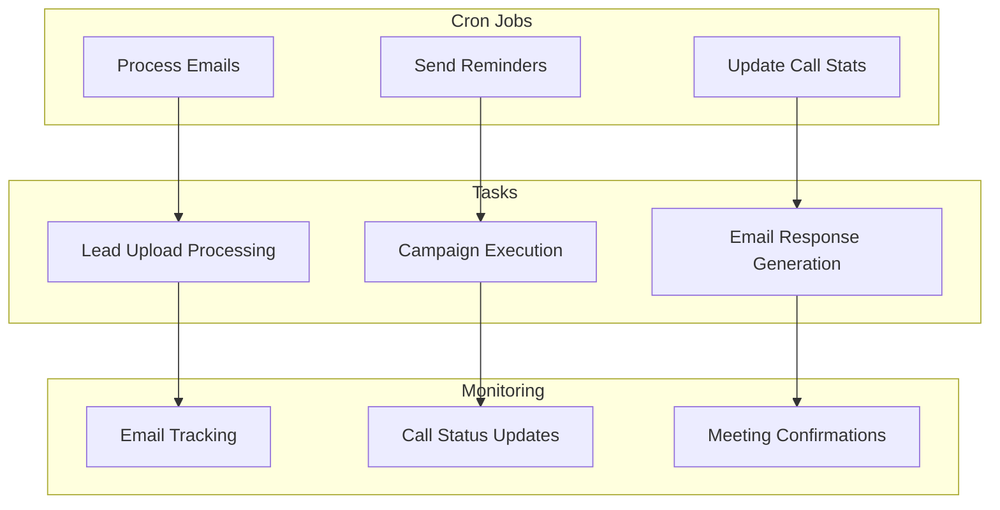
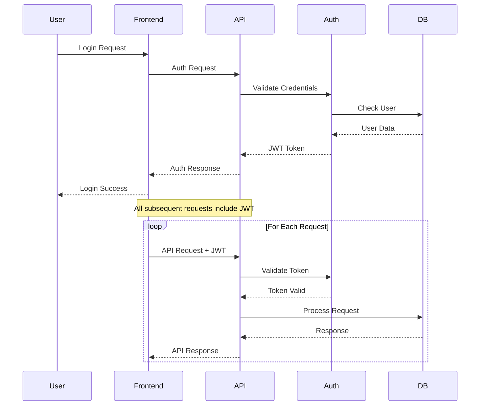
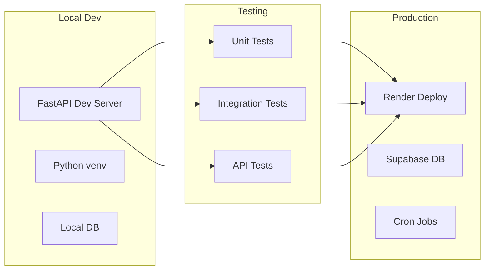

# Architectural Overview

## System Architecture

## Core Business Flow

## Data Model Relationships

## Email Processing Flow

## Call Campaign Flow

## Background Tasks

## Security Flow

## Development Environment

