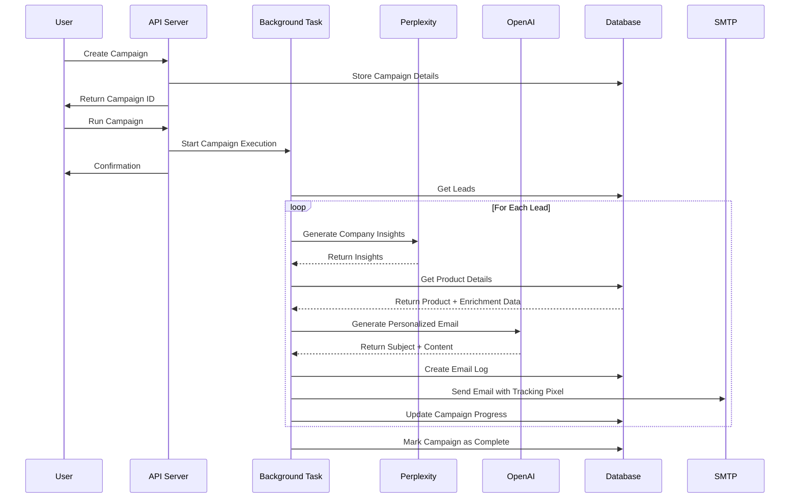

# Email Campaign Flow Documentation

This document outlines the complete flow of email campaigns in the ReachGenie system, from creation to execution, including data flow, service responsibilities, content generation, and database storage.

## Table of Contents

1. [Campaign Creation](#campaign-creation)
2. [Campaign Execution](#campaign-execution)
3. [Email Content Generation](#email-content-generation)
4. [Email Sending Process](#email-sending-process)
5. [Database Storage](#database-storage)
6. [Tracking and Analytics](#tracking-and-analytics)
7. [System Architecture](#system-architecture)
8. [Automated Follow-up System](#automated-follow-up-system)
9. [Product Enrichment](#product-enrichment)

## Campaign Creation

### API Endpoint

The campaign creation process begins with a POST request to the `/api/companies/{company_id}/campaigns` endpoint:

```python
@app.post("/api/companies/{company_id}/campaigns", response_model=EmailCampaignInDB, tags=["Campaigns & Emails"])
async def create_company_campaign(
    company_id: UUID,
    campaign: EmailCampaignCreate,
    current_user: dict = Depends(get_current_user)
)
```

### Request Validation

1. The endpoint validates that the user has access to the specified company
2. It verifies that the product specified in the campaign exists and belongs to the company
3. The campaign data is validated through the `EmailCampaignCreate` Pydantic model

### Database Storage

The campaign is stored in the database using the `create_campaign` function:

```python
async def create_campaign(company_id: UUID, name: str, description: Optional[str], product_id: UUID, type: str = 'email', template: Optional[str] = None):
    campaign_data = {
        'company_id': str(company_id),
        'name': name,
        'description': description,
        'product_id': str(product_id),
        'type': type,
        'template': template
    }
    response = supabase.table('campaigns').insert(campaign_data).execute()
    return response.data[0]
```

### Key Fields

- `name`: The name of the campaign
- `description`: A description of the campaign's purpose
- `product_id`: The product associated with the campaign
- `type`: The type of campaign (email, call, etc.)
- `template`: The email template to use for the campaign

## Campaign Execution

### Execution Endpoint

Campaigns are executed through the `/api/campaigns/{campaign_id}/run` endpoint:

```python
@app.post("/api/campaigns/{campaign_id}/run", tags=["Campaigns & Emails"])
async def run_campaign(
    campaign_id: UUID,
    background_tasks: BackgroundTasks,
    current_user: dict = Depends(get_current_user)
)
```

### Execution Flow

1. The endpoint validates that the user has access to the campaign
2. It retrieves the campaign and company details
3. For email campaigns, it validates that the company has email credentials configured
4. The campaign execution is delegated to a background task using FastAPI's `BackgroundTasks`

```python
# Add the task to run in the background
background_tasks.add_task(run_company_campaign, campaign_id)
```

### Background Processing

The `run_company_campaign` function handles the campaign execution in the background:

```python
async def run_company_campaign(campaign_id: UUID):
    """Background task to run campaign of the company"""
    # Get campaign and company details
    campaign = await get_campaign_by_id(campaign_id)
    company = await get_company_by_id(campaign["company_id"])
    
    # Process campaign based on type
    if campaign['type'] == 'email':
        await run_email_campaign(campaign, company)
    elif campaign['type'] == 'call':
        await run_call_campaign(campaign, company)
```

## Email Content Generation

### Lead Selection

The system selects leads with valid email addresses for the campaign:

```python
# Get all leads having email addresses
leads = await get_leads_with_email(campaign['id'])
```

### Company Insights Generation

For each lead, the system generates company insights using the Perplexity API:

```python
async def generate_company_insights(lead: dict, perplexity_service) -> dict:
    """Generate company insights using Perplexity API for a given lead"""
    company_name = lead.get('company', '')
    company_website = lead.get('website', '')
    company_description = lead.get('company_description', '')
    
    insights = await perplexity_service.get_company_insights(
        company_name=company_name,
        company_website=company_website,
        company_description=company_description
    )
    
    return insights
```

### Product Enrichment Integration

The system checks for and utilizes enriched product information when generating email content:

```python
# Prepare product information and check for enriched data
product_info = product.get('description', 'Not available')
enriched_info = product.get('enriched_information')
enriched_data = ""

if enriched_info:
    logger.info(f"Using enriched product information for email generation")
    
    if enriched_info.get('overview'):
        enriched_data += f"\nOverview: {enriched_info.get('overview')}"
    
    if enriched_info.get('key_value_proposition'):
        enriched_data += f"\nKey Value Proposition: {enriched_info.get('key_value_proposition')}"
    
    if enriched_info.get('pricing'):
        enriched_data += f"\nPricing: {enriched_info.get('pricing')}"
    
    if enriched_info.get('market_overview'):
        enriched_data += f"\nMarket Overview: {enriched_info.get('market_overview')}"
    
    if enriched_info.get('competitors'):
        enriched_data += f"\nCompetitors: {enriched_info.get('competitors')}"
    
    reviews = enriched_info.get('reviews', [])
    if reviews and len(reviews) > 0:
        enriched_data += "\nReviews:"
        for review in reviews:
            enriched_data += f"\n- {review}"
```

### Email Content Generation

The system uses OpenAI to generate personalized email content for each lead, leveraging enriched product data when available:

```python
async def generate_email_content(lead: dict, campaign: dict, company: dict, insights: str) -> Optional[tuple[str, str]]:
    """Generate personalized email content based on campaign and company insights using OpenAI"""
    # Initialize OpenAI client
    client = AsyncOpenAI(api_key=settings.openai_api_key)
    
    # Get product details
    product = await get_product_by_id(campaign['product_id'])
    
    # Prepare product information and check for enriched data
    product_info = product.get('description', 'Not available')
    enriched_info = product.get('enriched_information')
    enriched_data = ""
    
    if enriched_info:
        # Process enriched information to include in the prompt
        # (overview, key value proposition, pricing, market, competitors, reviews)
    
    # Construct the prompt with lead and campaign information
    prompt = f"""
    You are an expert sales representative who have capabilities to pitch the leads about the product.

    Lead's history and Information:
    - Company Name: {lead.get('company', '')}
    - Contact Name: {lead.get('first_name', '')} {lead.get('last_name', '')}
    - Company Description: {lead.get('company_description', 'Not available')}
    - Analysis: {insights}

    Product Information:
    {product_info}
    
    {enriched_data if enriched_info else ""}

    Company Information (for signature):
    - Company Name: {company.get('name', '')}
    - Email: {company.get('account_email', '')}

    Create two pieces of content:
    1. Email Subject: Compelling subject line mentioning our product and key benefits
    2. Email Content: Professional HTML email highlighting specific benefits for their business
    
    {f'''
    - Use the detailed product information to craft a more compelling message
    - Incorporate the key value propositions that align with the lead's needs
    - If appropriate, highlight how the product stands out from competitors
    - Use market insights to show understanding of the lead's industry challenges
    - Reference positive reviews when useful to build credibility
    ''' if enriched_info else ""}
    """
    
    # Generate content using OpenAI
    response = await client.chat.completions.create(
        model="gpt-4o-mini",
        messages=[
            {
                "role": "system",
                "content": "You are an expert sales representative crafting personalized email content."
            },
            {
                "role": "user",
                "content": prompt
            }
        ],
        temperature=0.7,
        max_tokens=1000,
        response_format={ "type": "json_object" }
    )
    
    # Parse the response
    content = response.choices[0].message.content.strip()
    email_content = json.loads(content)
    
    return email_content["subject"], email_content["body"]
```

## Email Sending Process

### SMTP Client Initialization

The system initializes an SMTP client with the company's email credentials:

```python
# Decrypt the password
decrypted_password = decrypt_password(company["account_password"])

# Initialize SMTP client            
async with SMTPClient(
    account_email=company["account_email"],
    account_password=decrypted_password,
    provider=company["account_type"]
) as smtp_client:
    # Email sending logic
```

### Email Preparation and Sending

For each lead, the system:

1. Creates an email log entry in the database
2. Adds a tracking pixel to the email body
3. Sends the email using the SMTP client
4. Creates an email log detail entry with the sent email content

```python
# Create email log first to get the ID for reply-to
email_log = await create_email_log(
    campaign_id=campaign['id'],
    lead_id=lead['id'],
    sent_at=datetime.now(timezone.utc)
)

# Add tracking pixel to the email body
final_body_with_tracking = add_tracking_pixel(final_body, email_log['id'])

# Send email with reply-to header
await smtp_client.send_email(
    to_email=lead['email'],
    subject=subject,
    html_content=final_body_with_tracking,
    from_name=company["name"],
    email_log_id=email_log['id']
)

# Create email log detail
await create_email_log_detail(
    email_logs_id=email_log['id'],
    message_id=None,
    email_subject=subject,
    email_body=body_without_tracking_pixel,
    sender_type='assistant',
    sent_at=datetime.now(timezone.utc),
    from_name=company['name'],
    from_email=company['account_email'],
    to_email=lead['email']
)
```

## Database Storage

### Database Tables

The system uses the following tables to store email campaign data:

1. `campaigns`: Stores campaign metadata
2. `email_logs`: Tracks each email sent as part of a campaign
3. `email_log_details`: Stores the details of each email, including subject and body

### Email Log Creation

```python
async def create_email_log(campaign_id: UUID, lead_id: UUID, sent_at: datetime):
    log_data = {
        'campaign_id': str(campaign_id),
        'lead_id': str(lead_id),
        'sent_at': sent_at.isoformat()
    }
    response = supabase.table('email_logs').insert(log_data).execute()
    return response.data[0]
```

### Email Log Detail Creation

```python
async def create_email_log_detail(
    email_logs_id: UUID, 
    message_id: str, 
    email_subject: str, 
    email_body: str, 
    sender_type: str, 
    sent_at: Optional[datetime] = None,
    from_name: Optional[str] = None,
    from_email: Optional[str] = None,
    to_email: Optional[str] = None,
    reminder_type: Optional[str] = None
):
    # Create email log detail record
    detail_data = {
        'email_logs_id': str(email_logs_id),
        'message_id': message_id,
        'email_subject': email_subject,
        'email_body': email_body,
        'sender_type': sender_type,
        'sent_at': sent_at.isoformat() if sent_at else None,
        'from_name': from_name,
        'from_email': from_email,
        'to_email': to_email,
        'reminder_type': reminder_type
    }
    response = supabase.table('email_log_details').insert(detail_data).execute()
    return response.data[0]
```

## Tracking and Analytics

### Email Tracking

The system adds a tracking pixel to each email to track when it's opened:

```python
def add_tracking_pixel(html_content: str, email_log_id: UUID) -> str:
    """Add tracking pixel to HTML content"""
    tracking_url = f"{settings.webhook_base_url}/api/track-email/{email_log_id}"
    tracking_pixel = f''
    
    # Add tracking pixel before the closing body tag
    if '</body>' in html_content:
        return html_content.replace('</body>', f'{tracking_pixel}</body>')
    else:
        return html_content + tracking_pixel
```

### Tracking Endpoint

The system provides an endpoint to track email opens:

```python
@app.get("/api/track-email/{email_log_id}", tags=["Campaigns & Emails"])
async def track_email(email_log_id: UUID):
    try:
        # Update the email log to mark it as opened
        await update_email_log_has_opened(email_log_id)
        
        # Return a transparent 1x1 pixel
        return Response(content=b'\x47\x49\x46\x38\x39\x61\x01\x00\x01\x00\x80\x00\x00\xff\xff\xff\x00\x00\x00\x21\xf9\x04\x01\x00\x00\x00\x00\x2c\x00\x00\x00\x00\x01\x00\x01\x00\x00\x02\x02\x44\x01\x00\x3b', media_type="image/gif")
    except Exception as e:
        logger.error(f"Error tracking email open: {str(e)}")
        return Response(content=b'\x47\x49\x46\x38\x39\x61\x01\x00\x01\x00\x80\x00\x00\xff\xff\xff\x00\x00\x00\x21\xf9\x04\x01\x00\x00\x00\x00\x2c\x00\x00\x00\x00\x01\x00\x01\x00\x00\x02\x02\x44\x01\x00\x3b', media_type="image/gif")
```

## System Architecture

### Components Involved

1. **FastAPI Application**: Handles API requests and responses
2. **Background Tasks**: Processes campaign execution asynchronously
3. **Supabase Database**: Stores campaign data, email logs, and tracking information
4. **OpenAI Integration**: Generates personalized email content
5. **Perplexity API**: Provides company insights for personalization and product enrichment
6. **SMTP Client**: Sends emails using the company's email credentials

### Data Flow

1. User creates a campaign through the API
2. User triggers campaign execution through the API
3. System processes the campaign in the background
4. For each lead:
   - System generates company insights using Perplexity API
   - System retrieves product information, including enriched data when available
   - System generates personalized email content using OpenAI, leveraging product enrichment
   - System sends the email using the SMTP client
   - System logs the email in the database
5. System tracks email opens and replies
6. User can view campaign analytics through the API

### Security Considerations

1. Email credentials are encrypted in the database
2. Password decryption happens only at the time of sending emails
3. API endpoints are protected with authentication
4. Background tasks run with proper error handling and logging

## End-to-End Email Campaign Generation Flow

### Visual Flowchart



### Detailed Step-by-Step Process

1. **Campaign Creation**
   - User creates a campaign via API, specifying:
     - Campaign name and type (email)
     - Target leads
     - Product to promote
     - Optional template customization

2. **Campaign Execution**
   - User triggers campaign execution
   - System creates a campaign run record
   - Background task starts processing

3. **Lead Processing (for each lead)**
   - System validates lead has email address
   - Retrieves enriched product data if available

4. **Company Research**
   - Perplexity API analyzes the prospect's company
   - Generates insights on:
     - Current functionality and limitations
     - Customer pain points
     - Industry challenges
     - Revenue impact analysis

5. **Content Generation**
   - OpenAI generates personalized email using:
     - Lead information (name, company, position)
     - Company insights from Perplexity
     - Product details and enrichment data
     - Sending company information

6. **Email Preparation**
   - Inserts generated content into template
   - Adds tracking pixel for open tracking
   - Creates email log in database

7. **Email Sending**
   - Connects to SMTP server with company credentials
   - Sends email to prospect
   - Updates campaign progress

8. **Follow-up Processing**
   - System monitors for email opens and replies
   - After 2 days without response, generates reminder email
   - Processes any replies with AI-generated responses

### Key AI Integration Points

1. **Company Analysis (Perplexity API)**
   - Input: Company name, website, description
   - Output: Structured insights about company needs and challenges
   - Purpose: Understand prospect's business context

2. **Email Content Generation (OpenAI API)**
   - Input: 
     - Lead data
     - Company insights
     - Product information
     - Enrichment data
   - Output: Personalized subject line and email body
   - Purpose: Create compelling, targeted messaging

3. **Response Generation (OpenAI API)**
   - Input: Original email, prospect's reply
   - Output: Contextually appropriate follow-up message
   - Purpose: Continue conversation with minimal human intervention

### Performance Metrics

The system tracks several key metrics for email campaigns:
- Open rate (via tracking pixel)
- Reply rate
- Meeting booking rate
- Campaign completion rate
- Email delivery success rate

This comprehensive, AI-driven approach ensures each prospect receives highly personalized communication that addresses their specific business needs rather than generic marketing content.

## Automated Follow-up System

The ReachGenie system includes a sophisticated automated follow-up mechanism that sends reminder emails to prospects who haven't replied to the initial campaign emails. This ensures continuous engagement with leads and increases the chances of conversion.

### Reminder Types and Scheduling

The system supports multiple reminder types, which are sent in sequence:
- **First Reminder (r1)**: Sent 2 days after the initial email if no reply is received
- **Second Reminder (r2)**: Sent 2 days after the first reminder if still no reply
- **Third Reminder (r3)**: Sent 2 days after the second reminder (optional, configurable)

### Reminder Content Generation

For each reminder, the system generates personalized follow-up content using OpenAI:

```python
async def get_reminder_content(original_email_body: str, reminder_type: str) -> str:
    """Generate reminder email content using OpenAI based on the original email"""
    # Determine the ordinal based on reminder type
    reminder_ordinal = {
        None: "1st",
        "r1": "2nd",
        "r2": "3rd and final"
    }.get(reminder_type, "1st")
    
    # Generate content using OpenAI with specific instructions
    response = await client.chat.completions.create(
        model="gpt-4o-mini",
        messages=[
            {"role": "system", "content": system_prompt},
            {"role": "user", "content": user_prompt}
        ],
        temperature=0.7,
        max_tokens=500
    )
    
    return response.choices[0].message.content.strip()
```

The system ensures each reminder:
1. References the original email content
2. Maintains a professional and courteous tone
3. Expresses interest in following up
4. Asks if the prospect had a chance to review the previous email
5. Inquires about any questions or concerns

### Database Tracking

The system tracks reminder status in the database:

```python
async def update_reminder_sent_status(email_log_id: UUID, reminder_type: str, last_reminder_sent_at: datetime) -> bool:
    """Update the last_reminder_sent field and timestamp for an email log"""
    response = supabase.table('email_logs')\
        .update({
            'last_reminder_sent': reminder_type,
            'last_reminder_sent_at': last_reminder_sent_at.isoformat()
        })\
        .eq('id', str(email_log_id))\
        .execute()
    return bool(response.data)
```

Each email log record contains:
- `last_reminder_sent`: The type of the last reminder sent (r1, r2, etc.)
- `last_reminder_sent_at`: Timestamp when the last reminder was sent
- `has_replied`: Boolean indicating if the prospect has replied

### Automated Execution

The reminder system runs automatically via a cron job:

```bash
#!/bin/bash
set -o errexit -o nounset -o pipefail
cd /app
cronlock python -m src.scripts.send_reminders
```

This script executes the reminder process, which:
1. Fetches all email logs that need reminders based on timing and reply status
2. Groups them by company for batch processing
3. For each company, initializes an SMTP client with the company's credentials
4. Generates and sends personalized reminder emails to each lead
5. Updates the database with the new reminder status

### Eligibility Criteria for Reminders

The system determines which emails need reminders based on specific criteria:

```python
async def get_email_logs_reminder(reminder_type: Optional[str] = None):
    """Fetch all email logs that need to be processed for reminders"""
    # Calculate the date threshold (2 days ago from now)
    two_days_ago = (datetime.now(timezone.utc) - timedelta(days=2)).isoformat()
    
    # Build query with appropriate filters
    if reminder_type is None:
        # For first reminder: no reminder sent yet + initial email sent > 2 days ago
        query = query\
            .is_('last_reminder_sent', 'null')\
            .lt('sent_at', two_days_ago)
    else:
        # For subsequent reminders: last reminder type matches + sent > 2 days ago
        query = query\
            .eq('last_reminder_sent', reminder_type)\
            .lt('last_reminder_sent_at', two_days_ago)
```

This ensures that:
1. Reminders are only sent if the prospect hasn't replied
2. Sufficient time (2 days) has passed since the previous communication
3. The company is still active (not deleted)
4. The reminder sequence is followed correctly

### Integration with Main Campaign Flow

The reminder system complements the main campaign flow by:
1. Using the same email tracking mechanisms (tracking pixels)
2. Storing reminder emails in the same database tables
3. Following the same security practices for email credentials
4. Maintaining consistent branding and messaging

This automated follow-up system significantly enhances the effectiveness of email campaigns by ensuring multiple touchpoints with prospects, increasing the likelihood of engagement and conversion.

## Product Enrichment

The system leverages enriched product information to create more personalized and effective email campaigns. When a product is created or updated with a product URL, the system automatically enriches the product with additional information.

### Enrichment Data Types

The enriched product information includes:
- **Overview**: General description of the product
- **Key Value Proposition**: Main selling points
- **Pricing**: Pricing information if available
- **Market Overview**: Information about the market
- **Competitors**: List of competitors
- **Reviews**: Up to 3 good reviews

### Integration with Email Generation

During email content generation, the system checks if enriched product information is available:

```python
enriched_info = product.get('enriched_information')
if enriched_info:
    logger.info(f"Using enriched product information for email generation")
    
    # Extract and format enriched information for the prompt
    # Add special LLM instructions to leverage the enriched data
```

### Enhanced Personalization

When enriched product data is available, the system:
1. Provides detailed product information to the LLM
2. Adds special instructions to the LLM to:
   - Incorporate key value propositions aligned with lead's needs
   - Highlight how the product stands out from competitors
   - Use market insights to show understanding of industry challenges
   - Reference positive reviews to build credibility

### Benefits of Product Enrichment

The product enrichment integration enables:
1. **More compelling messaging**: Emails contain specific value propositions rather than generic descriptions
2. **Competitive positioning**: Emails can highlight advantages over competitors
3. **Industry relevance**: Content can reference market trends and challenges
4. **Increased credibility**: Inclusion of reviews and actual pricing builds trust
5. **Higher personalization**: AI can match specific product benefits to the lead's likely needs

This feature significantly improves the quality and effectiveness of email campaigns by providing the AI with richer, more detailed product information to craft personalized messaging.

This document provides a comprehensive overview of the email campaign flow in the ReachGenie system. For more detailed information on specific components, please refer to the codebase or other documentation. 