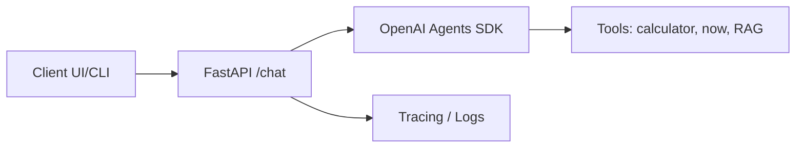
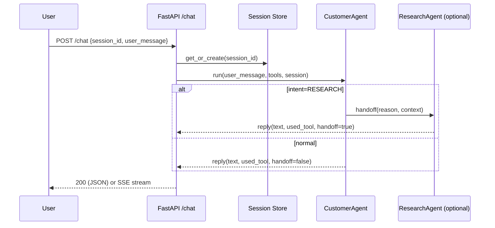
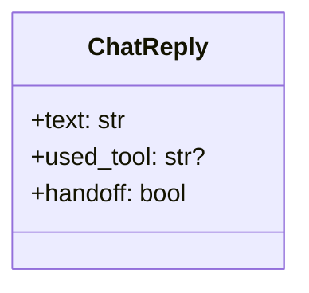
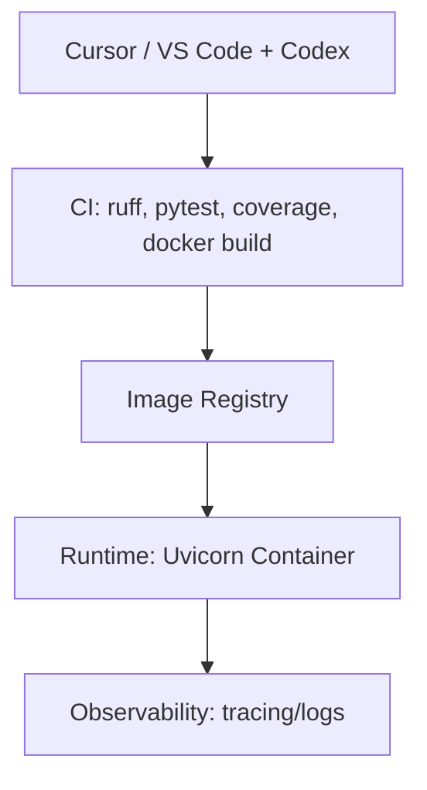

# AI-First Playbook: Diagram Stubs & First Iterations (Comprehensive Examples)

This companion document gives you **diagram stubs** (Mermaid) and **fully-worked Prompt History Record (PHR)** examples for your first three slices: **/healthz**, **/chat (non-streaming)**, and **/chat (SSE streaming)**. Copy/paste the prompts into **Cursor** (Composer), accept small diffs, and link each PHR in your PR.

---

## Diagrams to include (Mermaid stubs)

### 1) Context


### 2) Runtime sequence (/chat)


### 3) Contracts


### 4) Deployment


---

## Iteration 1 — `/healthz` (PDD × TDD)

### PHR-0001 — Architect (paste into Cursor Composer)
```text
Goal: Implement GET /healthz returning {"status":"ok"}.
Acceptance:
- Given GET /healthz, Then HTTP 200 and body {"status":"ok"}
Constraints:
- minimal diff; no new deps; update README with curl example
Out of scope:
- auth, db, tracing
```

### PHR-0002 — Red (tests only)
```text
Add failing test tests/test_healthz.py::test_healthz_ok expecting 200 and {"status":"ok"}.
No production code changes. Keep tests offline.
```

### PHR-0003 — Green (smallest diff)
```text
Implement GET /healthz to pass the test. Update README with a curl example.
Output: diff-only; no unrelated edits.
```

### PHR-0004 — Explainer
```text
Explain the diff in <=8 bullets; call out risks and follow-ups.
```

**Expected artifacts**
- `app/main.py` route
- `tests/test_healthz.py` passing
- README curl snippet

---

## Iteration 2 — `/chat` (non-streaming)

### PHR-0005 — Architect
```text
POST /chat {session_id, user_message} → JSON ChatReply {text, used_tool?, handoff:boolean}
Errors:
- 400 when user_message is missing
Sessions:
- Maintain conversation per session_id
Acceptance:
- 200 happy path
- 400 for missing user_message
Constraints:
- minimal diff; offline tests; no new deps
```

### PHR-0006 — Red
```text
Add contract tests:
- test_chat_happy_path_200()
- test_chat_missing_user_message_400()
No production code.
```

### PHR-0007 — Green
```text
Implement minimal /chat to pass the tests:
- Use Agents SDK Runner
- Expose ChatReply {text, used_tool?, handoff}
- In-memory sessions keyed by session_id
Output: diff-only
```

### PHR-0008 — Explainer
```text
Summarize changes (8 bullets), trade-offs, and coverage.
```

**Expected artifacts**
- `app/agents/core.py` (runner/session wiring)
- `app/guards/schemas.py` (ChatReply)
- `app/main.py` (/chat)
- tests for 200/400

---

## Iteration 3 — `/chat` with **SSE streaming**

### PHR-0009 — Architect
```text
Extend /chat with SSE when `Accept: text/event-stream`; fallback JSON otherwise.
Acceptance:
- SSE: correct headers; event format "data:<token>\n\n"
- JSON fallback remains intact
Constraints:
- minimal diff; no new deps; offline tests
```

### PHR-0010 — Red
```text
Add failing SSE tests for headers + event format; keep offline.
```

### PHR-0011 — Green
```text
Implement SSE streaming path; preserve non-streaming behavior.
Output: diff-only.
```

### ADR-0002 — Streaming Protocol Choice (SSE vs WS vs Polling)
```text
Create ADR 'streaming-protocol-choice' with Context, Options, Decision (SSE), Consequences, References.
Link in PR.
```

### PHR-0012 — Explainer
```text
Explain how streaming works, test coverage, and edge cases.
```

**Expected artifacts**
- `app/streaming.py` (optional helper)
- SSE branch in `app/main.py`
- `tests/test_chat_streaming.py`
- `docs/adr/0002-streaming-protocol.md`

---

## PR/ADR/PHR Integration (checklist)
- 🧾 **PHR files** committed for architect/red/green/explainer
- 🧪 Tests green locally and in CI
- 🧠 ADR linked for consequential decisions
- 🔒 No secrets in prompts; `.env.sample` updated
- ✅ PR small, focused, with curl/screenshots and rollback notes

---

## Tips that keep Cursor effective
- Write prompts like **GitHub Issues** (paths, acceptance tests, constraints, out-of-scope).
- Use **Ask Mode → Code Mode**: plan first, then implement from the plan.
- Keep diffs **small**; push follow-ups to the **task queue**.
- Stabilize environment: setup scripts, mocks, deterministic tests.

You're ready—open the repo in Cursor, paste PHR-0001, and start shipping in baby steps (with a suit on).
